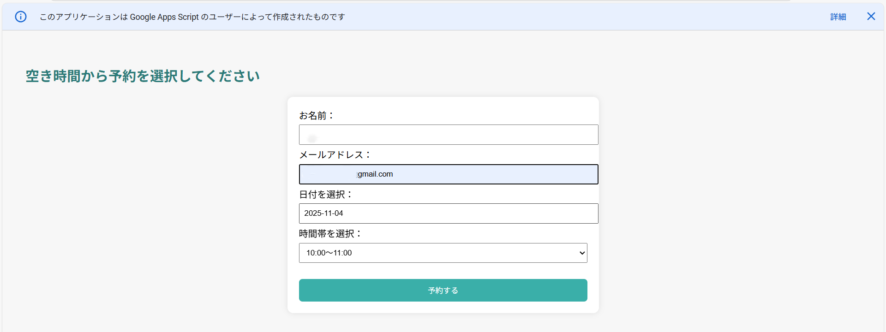
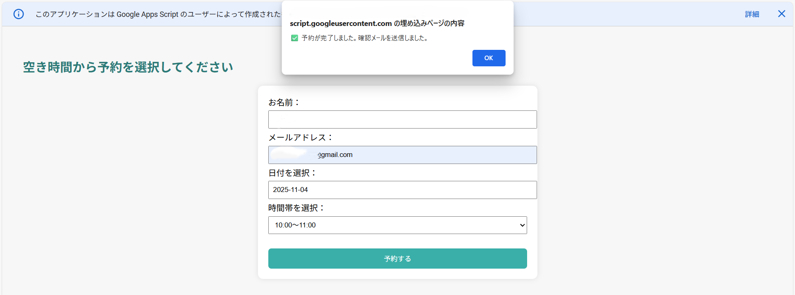

<h1>📅 Googleカレンダー自動日程調整システム</h1>

<div align="center">

<p><strong>日程調整の手間を、たった1つのURLで解決</strong></p>

<p>
<a href="https://script.google.com">
  
</a>
<a href="https://calendar.google.com">
  
</a>
</p>

<p><strong>「明日15時空いてますか？」のやり取りが不要になります。</strong></p>

</div>

---

## 📖 目次

- [システム概要](#-システム概要)
- [解決した課題](#-解決した課題)
- [主な機能](#️-主な機能)
- [画面イメージ](#️-画面イメージ)
- [システムの流れ](#-システムの流れ)
- [技術的な工夫](#-技術的な工夫)
- [実際の運用状況](#-実際の運用状況)
- [技術スタック](#-技術スタック)
- [学びと強み](#-学びと強み)
- [提供可能なサービス](#-提供可能なサービス)
- [開発者について](#-開発者について)
- [お問い合わせ](#-お問い合わせ)

---

## 📌 システム概要

### これは何か

個人事業主の方が抱える「日程調整のやり取り」を自動化したWebアプリケーションです。

クライアントは送られてきたURLから希望日時を選ぶだけ。  
予約完了と同時にGoogleカレンダーへ自動登録され、双方に通知メールが届きます。

### 3つの特徴

<div align="center">

| 特徴 | 説明 |
|------|------|
| 🔗 **URLを送るだけ** | やり取り不要、クライアントが自分で予約 |
| 📅 **自動カレンダー登録** | 予約完了と同時にGoogleカレンダーへ反映 |
| 🔒 **ダブルブッキング防止** | 排他制御で予約競合を完全に防止 |

</div>

---

## 🎯 解決した課題

### 依頼者が抱えていた問題

複数のクライアントと日々やり取りをする個人事業主の方から、こんな声をいただきました：

- 「毎回、日程候補のすり合わせが手間」
- 「スケジュールを見比べて調整する作業が地味に大変」
- 「TimeTreeを使っているけど、自動化できないか？」

### 課題の本質は何か

話を整理すると、求められていたのは  
❌ **特定のアプリとの連携** ではなく  
✅ **日程調整そのものを楽にする仕組み** でした。

**一般的な日程調整の問題点**

```
1. クライアントから希望日を聞く
   ↓
2. 自身のスケジュールを確認
   ↓
3. 再度候補日を連絡
   ↓
4. 場合によっては再調整
   ↓
この往復がアポ数に比例して増える ← ここが問題
```

### 解決策

**このシステムなら**

```
1. 予約URLを送る
   ↓
2. クライアントが空き時間から選択
   ↓
3. 自動でカレンダー登録＆通知
   ↓
完了！（やり取りゼロ）
```

---

## ⚙️ 主な機能

### 1. リアルタイム空き枠判定 🗓

- Googleカレンダーの予定を自動取得
- **既存予定 + 前後15分バッファ** を考慮
- 空いている日時のみ選択可能に

**工夫ポイント**
> 前後15分のバッファで、連続予約や移動時間を考慮した  
> 現実的なスケジュール管理を実現

---

### 2. 予約の完全自動化 📩

- クライアント側で日時選択 → 送信
- **双方へ自動メール通知**
  - クライアント向け：予約完了メール
  - 管理者向け：新規予約通知
- Googleカレンダーへ自動登録

**工夫ポイント**
> 手動でカレンダーに入力する手間がゼロに

---

### 3. ダブルブッキング防止 🔒

- `LockService`による排他制御
- 同時アクセスでも予約競合を防止

**工夫ポイント**
> 複数人が同じ時間を予約しようとしても、確実に1件ずつ処理

---

### 4. 直感的なUI 🎨

- `flatpickr`で見やすいカレンダー表示
- 土日や予約不可日をグレーアウト表示
- クライアント側で迷わない画面設計

**工夫ポイント**
> 説明不要で操作できる、エラーを起こさせない設計

---

## 🖥️ 画面イメージ

### 予約フォーム画面

<div align="center">
  
</div>

*クライアントが見る画面。氏名・メール・希望日時を入力*

---

### カレンダー選択画面

<div align="center">
  
</div>

*空いている日時のみ選択可能。土日や既存予定は自動的にグレーアウト*

---

## 🧩 システムの流れ

### 予約フロー

```
1. ユーザーが予約フォームへアクセス
   ↓
2. flatpickr で「空いている日・時間だけ」を選択
   ↓
3. GAS が Google カレンダー予定を取得
   ↓
4. バッファ（15分）を考慮して空き枠を生成
   ↓
5. ユーザー・管理者へ自動メール通知
   ↓
6. Google カレンダーにイベント作成
   ↓
完了！
```

---

## 🔧 技術的な工夫

### ① バッファ付き重複判定の実装

前後15分のバッファを付与し、予定が詰まりすぎないよう調整：

```javascript
// 既存予定の前後15分をバッファとして確保
const bStart = new Date(ev.start.getTime() - BUFFER_MINUTES * 60000);
const bEnd   = new Date(ev.end.getTime() + BUFFER_MINUTES * 60000);

// 重複判定
const isOverlap = slotStart < bEnd && slotEnd > bStart;
```

**効果**
> 連続予約や移動時間を考慮した、現実的なスケジュール管理を実現

---

### ② flatpickrによるUI制御

空きがない日・土日を視覚的に選択不可に：

```javascript
disable: [
  function(date) {
    const day = date.getDay();
    const formatted = date.toISOString().slice(0,10);
    
    // 土日または空き枠ゼロの日は選択不可
    return EXCLUDE_DAYS.includes(day) || !slots[formatted];
  }
]
```

**効果**
> クライアント側で「予約できない日時」を間違えて選ぶことがない

---

### ③ LockServiceによる排他制御

同時アクセス時のダブルブッキングを防止：

```javascript
const lock = LockService.getScriptLock();
lock.waitLock(30000); // 最大30秒待機

// 予約処理
// ...

lock.releaseLock();
```

**効果**
> 複数人が同時に予約しても、確実に1件ずつ処理

---

### ④ メール通知（自動送信）

**ユーザー向け（予約完了メール）**
- 予約日時
- 入力内容の確認
- 任意でキャンセル案内も追加可能

**管理者向け（新規予約通知）**
- 新規予約通知
- 氏名・メールアドレス
- 予約日時

---

## 🚀 実際の運用状況

### 導入実績

✅ **知人の個人事業主に導入済み**
- スクリーンショット付き手順書を用意し、スムーズに設定完了
- 現在も日常的な日程調整に活用中

✅ **私自身の活用**
- 相談・打ち合わせの日程調整に使用中
- **「URLを送るだけで完結する」** 点を特に便利に感じています

---

## 🛠 技術スタック

<div align="center">

| 項目 | 技術 |
|------|------|
| 言語 | Google Apps Script (JavaScript) |
| カレンダー連携 | Google Calendar API |
| UI | flatpickr (日付選択ライブラリ) |
| メール通知 | Gmail / MailApp |
| 排他制御 | LockService |
| デプロイ | GAS Webアプリ |

</div>

### プロジェクト構成

```
プロジェクト/
├── main.gs      # 本体ロジック（API・空き枠生成・予約処理）
└── README.md    # プロジェクト説明
```

### なぜGoogleカレンダー + GASなのか

当初検討したTimeTreeはAPI非対応で自動化が困難でした。

そこで「**誰でも使い続けられること**」を最優先に、以下の理由でGASを選択：

<div align="center">

| 判断基準 | 理由 |
|---------|------|
| **導入ハードル** | Googleアカウントがあれば使える |
| **運用コスト** | サーバー不要、無料で運用可能 |
| **技術的障壁** | APIキー管理など複雑な設定が不要 |
| **継続性** | 設定後は日常運用がシンプル |

</div>

**設計思想**
> 「高機能」より「一般ユーザーが無理なく使い続けられる」を重視

---

## 📚 学びと強み

### このプロジェクトで学んだこと

#### 技術面

**GASによるWeb APIの実装**
- Google Calendar APIの活用
- `doGet()`/`doPost()`によるHTTPリクエスト処理

**JavaScriptでの日付・時刻計算**
- タイムゾーン考慮
- バッファ付き重複判定ロジック

**フロントエンド連携**
- flatpickrライブラリの導入
- HTMLテンプレートとGASの連携

---

#### 問題解決面

**課題の本質を見極める重要性**
- 「TimeTree連携」という手段ではなく
- 「日程調整の手間削減」という目的に立ち返る

**導入ハードルを下げる設計**
- 高機能より「誰でも使える」を優先
- 継続して使われることを前提とした設計判断

**一般ユーザー視点でのUI/UX**
- 説明不要で操作できる画面設計
- エラーを起こさせない制御

---

### 得たスキル

- ✅ Google Apps ScriptによるWebアプリケーション開発
- ✅ Google Calendar APIの実践的な活用
- ✅ 排他制御（LockService）の実装
- ✅ 日付・時刻計算とバッファ処理
- ✅ ユーザー視点での要件整理
- ✅ 継続運用を前提とした設計判断

---

## 🔄 今後の改善・展開案

現在検討している機能拡張：

- [ ] Google Meet URL の自動発行・通知
- [ ] 予約履歴の自動スプレッドシート保存
- [ ] クライアント側画面のデザインカスタマイズ
- [ ] 業種別の時間帯・表示項目の切り替え対応
- [ ] LINEやSlackへの通知連携

※ 実際の利用シーンやご要望をもとに、優先度を調整しながら段階的に実装予定です。

---

## 💼 提供可能なサービス

現在はポートフォリオ制作・検証開発を中心に、  
小規模・試作ベースでの業務効率化支援に対応しています。

### 1. Google Apps Script（GAS）を用いた小規模業務自動化・管理ツールの構築

**対応例**
- Googleカレンダーを活用した日程調整・予約管理システム
- メール送信・通知の自動化
- 手作業で行っている定型業務の自動化

> 「毎回同じ操作をしている」「地味に時間がかかっている」といった業務を、  
> 仕組みで解決することを目的としています。

---

### 2. Googleスプレッドシートを基盤とした管理システムの試作

**対応例**
- 予約・顧客・案件情報の一元管理
- スプレッドシート入力を起点とした自動処理
- 小規模チーム・個人事業主向けの簡易管理ツール

> 「Excel / スプレッドシートは使っているけど、限界を感じている」という  
> 段階の方に向いた構成です。

---

### 3. Web技術を用いた業務管理システムの試作・検証

**対応例**
- 本リポジトリのようなWeb UIを持つ管理画面の試作
- 業務フローを整理しながらの要件定義・画面設計
- 実運用を想定したプロトタイプ作成

> ※ 本格的な商品化・大規模運用を前提とした開発ではなく、  
> 「まず形にして試す」フェーズを重視しています。

---

### 4. 要件整理・相談ベースでのサポート

**対応例**
- 「システム化できるか分からない」段階からのご相談
- 業務内容のヒアリング・整理
- 自動化・効率化できそうなポイントの洗い出し

> 技術ありきではなく、  
> **「今のやり方がどう楽になるか」**を一緒に考えるスタンスです。

---

### 補足

※ 現在はポートフォリオ用途として段階的に開発・検証を行っており、  
提供内容・範囲・進め方については、案件ごとに個別相談ベースとなります。

---

## 👤 開発者について

### 開発者プロフィール

**[Misako]**

Google Workspace を中心とした  
**小規模業務の自動化・効率化ツールの試作・検証開発**を行っています。

現在はポートフォリオ制作を目的に、実務を想定した要件整理・設計・実装・テストまでを一通り行いながら、「実際に使われる前提」でのシステム構築を継続しています。

---

### 開発スタンス

- ヒアリング・要件整理を重視した設計
- 小さく作って、動かしながら改善する進め方
- 運用時のトラブルや制約（権限・排他制御など）も考慮した実装

---

### 現在取り組んでいること

- Google Apps Script（GAS）を用いた業務自動化ツール開発
- Google Calendar / Spreadsheet / Gmail 連携
- AIを活用した要件整理・コード設計・実装検証

実務実績はこれからですが、その分「分からないまま進めない」「必ず検証する」ことを大切にし、依頼者様と認識を揃えながら進めることを重視しています。

---

### 得意・関心分野

- 業務効率化・自動化ツールの設計・試作・改善
- Google Workspace（Calendar / Spreadsheet / Gmail）を活用した連携システム
- 手作業・属人化している業務の整理と仕組み化
- 小規模運用を前提とした、無理のないシステム設計

技術そのものを作ることよりも、  
**「この作業がなくなったら、どれくらい楽になるか」**  
を起点に考えることを大切にしています。

「複雑にしすぎない」「運用できる形で終わらせる」ことを意識した設計が強みです。

---

### こんな方のご相談に向いています

✅ **Googleカレンダーやスプレッドシートを日常的に使っている方**  
✅ **日程調整・連絡・転記作業に、地味な手間を感じている方**  
✅ **いきなり大きなシステムではなく、まずは小さく試したい方**  
✅ **業務をどう整理すればいいか、まだ言語化できていない方**

> 「システム化できるか分からない」  
> 「何を自動化すればいいのか分からない」

そんな段階からでも、一緒に状況を整理しながら、無理のない形で仕組みに落とすことを大切にしています。

---

## 📩 お問い合わせ

### ポートフォリオ全体に関するご相談・ご質問

公式LINEまたはクラウドソーシングサイトよりご連絡ください。

#### 📩 公式LINE（推奨）

[👉 公式LINEで問い合わせる](https://lin.ee/LQKST5q)

- **気軽にご相談いただけます**（24時間受付）
- 簡単な質問やヒアリングに最適
- レスポンス：原則24時間以内

#### 💼 クラウドソーシングサイト

- [ランサーズ](https://www.lancers.jp/profile/Mi1103)
- [クラウドワークス](https://crowdworks.jp/public/employees/6463085?ref=share_url_wkprofile)
- [ココナラ](https://coconala.com/users/5336527)

**「こんなこと相談していいのかな？」という段階からでも大歓迎です。**

---

## 📄 ライセンス

MIT License

---

<div align="center">

<p><strong>日程調整の手間を、たった1つのURLで解決します</strong></p>

<hr>

<p>
⭐ このプロジェクトが参考になりましたら、Starをいただけると嬉しいです<br>
📢 シェア・拡散も大歓迎です
</p>

<hr>

<p><em>最終更新日: 2026年2月</em></p>

</div>
