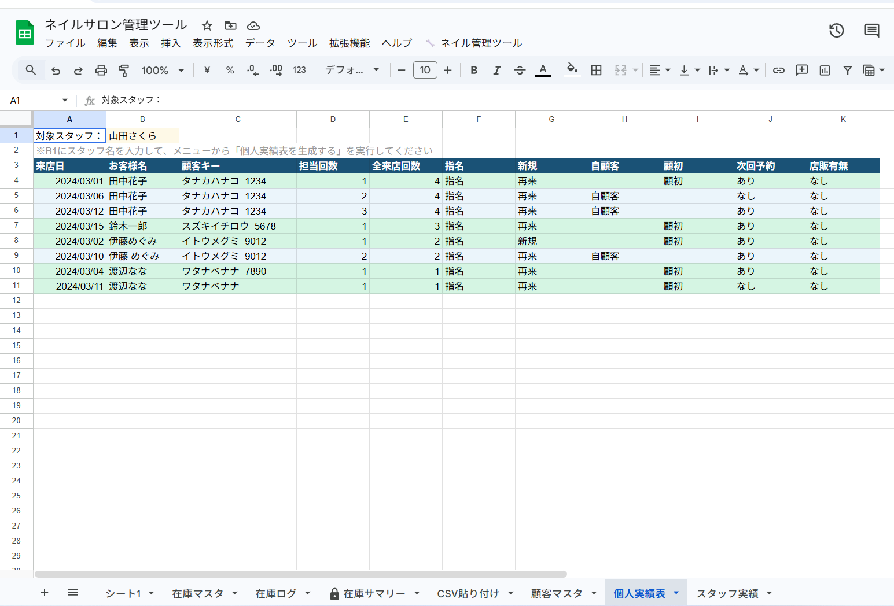
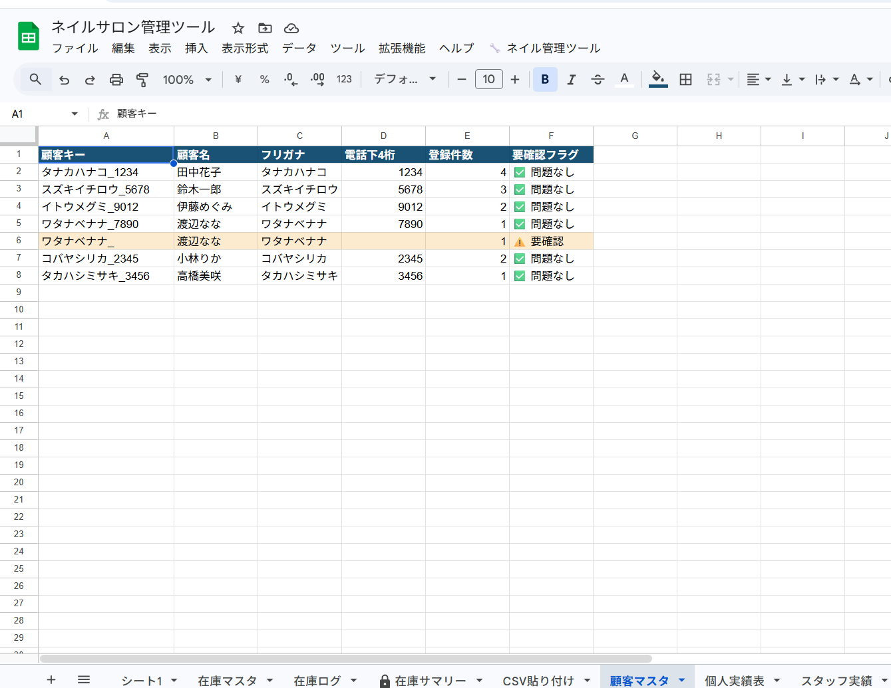
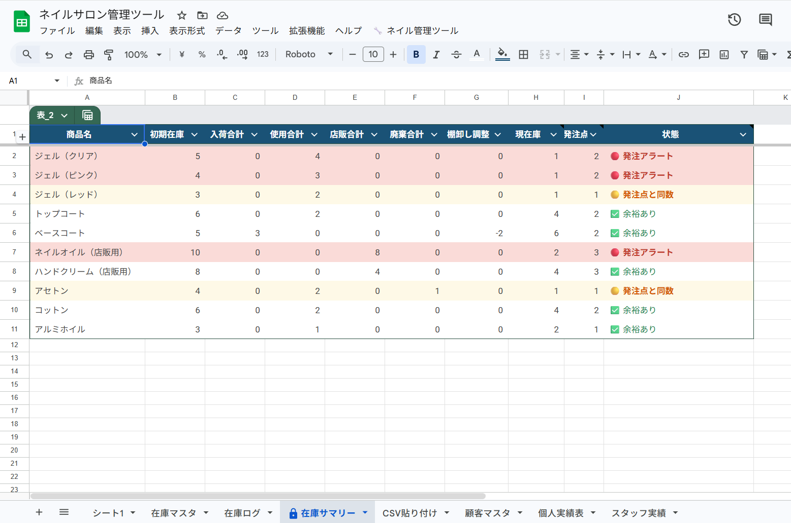

# ネイルサロン統合管理ツール（GAS × スプレッドシート）

<div align="center">

<p><strong>「サロンボードだけでは足りない、その先の管理」を自動化する</strong></p>

<p>
  
  
  
</p>

<p><strong>在庫管理・スタッフ実績集計・顧客統合を、CSVを貼るだけで完結</strong></p>

<p>⚠️ このリポジトリはポートフォリオ用です。ソースコードは非公開です。</p>

</div>

---

## 📖 目次

- [システム概要](#-システム概要)
- [開発背景](#-開発背景)
- [主な機能](#-主な機能)
- [画面イメージ](#-画面イメージ)
- [システムの流れ](#-システムの流れ)
- [技術的な工夫](#-技術的な工夫)
- [技術スタック](#-技術スタック)
- [開発情報](#-開発情報)
- [学びと強み](#-学びと強み)
- [今後の拡張](#-今後の拡張)
- [提供可能なサービス](#-提供可能なサービス)
- [開発者について](#-開発者について)
- [お問い合わせ](#-お問い合わせ)
- [ライセンス](#-ライセンス)

---

## 🎯 システム概要

ネイルサロン向けの統合管理ツールです。
予約管理ソフト「SALON BOARD」のCSVデータとスタッフの日々の在庫入力を一元管理し、**スタッフ別実績・現在庫・顧客来店履歴を自動で集計・可視化**します。

### 3つの特徴

| # | 特徴 | 詳細 |
|---|------|------|
| ① | **貼るだけで集計完了** | SALON BOARDのCSVをシートに貼り付けるだけで、スタッフ別実績表が自動生成される |
| ② | **顧客IDがなくても追跡できる** | フリガナ＋電話下4桁で「擬似顧客キー」を生成し、リピート率・担当回数を正確に把握 |
| ③ | **スマホからも在庫入力が可能** | Googleスプレッドシートアプリ経由でスマートフォンから在庫の増減を入力、現在庫を自動計算 |

### 対象ユーザー

| 対象 | 規模 | 主な利用シーン |
|------|------|--------------|
| ネイルサロン運営者・オーナー | 1〜10名規模 | 月次の実績集計・在庫確認 |
| サロンマネージャー | スタッフ管理担当 | スタッフKPIの把握・評価資料作成 |
| 現場スタッフ | 全員 | 日次の在庫入力・自分の実績確認 |

### プロジェクト規模

| 項目 | 内容 |
|------|------|
| 開発期間 | 約1週間（試作MVPフェーズ） |
| 管理シート数 | 5シート（CSV貼り付け・顧客マスタ・個人実績表・在庫台帳・発注リスト） |
| 主な機能数 | 5機能 |
| 対応CSV | SALON BOARD 予約一覧CSV・売上明細CSV |

---

## 💡 開発背景

### 解決する課題

ネイルサロンの現場では、予約管理ソフトと日常業務の間に大きなギャップが存在していました。

---

**📊 課題① 毎月の実績集計に何時間もかかっている**

SALON BOARDのCSVデータをもとに、スタッフごとの「指名数」「新規率」「次回予約取得率」「自顧客数」を手作業で計算・集計していた。月末になるたびに担当者が長時間の事務作業を強いられていました。

→ **解決策**: GASがCSVを自動解析し、スタッフ名を指定するだけで個人実績表を即時生成

---

**📦 課題② 在庫が今いくつあるか、誰もわからない**

「開封」「店販」「廃棄」「入荷」などの在庫の動きがバラバラに管理されており、正確な現在庫が把握できなかった。発注のタイミングも担当者の感覚頼みになっていました。

→ **解決策**: スプレッドシートアプリ経由でスタッフが在庫ログを入力し、現在庫と発注候補を自動集計・可視化

---

**🔍 課題③ 同じお客様が別人として記録されてしまう**

SALON BOARDには共通の顧客IDがないため、同じ方が「田中花子」「田中 花子」など表記ゆれで別人として記録されてしまい、正確なリピート率やLTV分析ができていませんでした。

→ **解決策**: フリガナ＋電話下4桁を組み合わせた「擬似顧客キー」で名寄せを自動化。判定困難な場合は「⚠️ 要確認」フラグで手動統合をサポート

---

**🔄 課題④ 同じデータを複数の場所に手で転記している**

SALON BOARDのデータをExcelに転記、さらに別の集計シートに転記…という二重・三重管理が常態化していました。

→ **解決策**: CSVを1か所に貼り付けるだけで、すべてのシートに自動展開される一元管理へ

---

## ✨ 主な機能

### 💚 機能1：CSVインポート＆自動パース

SALON BOARDからダウンロードした「予約一覧CSV」「売上明細CSV」をシートに貼り付けると、GASが自動で読み取り・整形します。

- 来店日・担当スタッフ・顧客情報・メニューなどを自動分類
- 不正なデータ行を除外し、集計精度を担保
- 列順が変わっても対応できる設定シートを用意（拡張予定）

> 💡 **工夫ポイント**：スタッフが毎月行う作業は「CSVを貼る」だけ。複雑な操作は一切不要です。

---

### 💙 機能2：スタッフ別個人実績表の自動生成

スタッフ名を入力してボタンを押すだけで、そのスタッフの全来店履歴と主要KPIが一覧で表示されます。

集計される項目：

| 項目 | 内容 |
|------|------|
| 来店日・お客様名 | 基本情報 |
| 担当回数 | そのスタッフが担当した累計回数 |
| 全来店回数 | 店全体での来店累計 |
| 指名 / 新規 | 各来店の区分 |
| 自顧客 | 担当2回目以降のお客様（自分の顧客）を自動判定 |
| 顧初（顧客初回） | 担当1回目のお客様を自動判定 |
| 次回予約 | 次回予約の有無 |
| 店販有無 | 商品購入の有無 |

試作段階で動作確認済みの色分け：
- 🟢 薄い緑：顧初（そのスタッフが初めて担当）
- 🔵 薄い青：自顧客（担当2回目以降のリピート顧客）

> 💡 **工夫ポイント**：評価資料としてそのまま印刷できるレイアウトを意識しました。

---

### 💗 機能3：顧客名寄せ＆マスタ自動生成

SALON BOARDに顧客IDがなくても、独自の「擬似顧客キー」でお客様を追跡できます。

```
顧客キー = フリガナ（カタカナ変換）＋ 電話番号下4桁
```

- 氏名の表記ゆれ（スペースあり・なしなど）を吸収して同一人物と判定
- 電話番号が不明な場合は「⚠️ 要確認」フラグを自動付与
- 手動で統合した情報を次回以降のCSV取り込みに引き継げる名寄せマスタ設計（拡張予定）

> 💡 **工夫ポイント**：「完全自動」にこだわらず、判定困難なケースは人間が確認する「人間との協調設計」を採用。精度と使いやすさのバランスを重視しました。

---

### 🏷️ 機能4：在庫ログ管理＆現在庫の自動計算

Googleスプレッドシートアプリ経由でスタッフが在庫の動きを入力すると、現在庫が自動で更新されます。スプレッドシートはスマートフォンからも操作できるため、現場での即時入力が可能です。

対応する在庫アクション：
- 📦 入荷
- 💅 使用（施術）
- 🛍️ 店販（販売）
- 📋 受注・取り置き
- 🗑️ 廃棄
- 🔢 棚卸し・調整

現在庫の計算式：

```
現在庫 = 初期在庫 + 入荷 − 使用 − 店販 ± 調整
```

---

### 🔔 機能5：発注候補の自動アラート

設定した在庫の下限を下回ると、発注候補リストに自動で表示されます。

- 商品ごとに発注目安の在庫数を設定
- 下回った商品を一覧化
- 担当者が確認・発注するだけのシンプルな運用フロー

---

## 📸 画面イメージ

---

### 01｜個人実績表（スタッフ別・色分け表示）

**ファイル名：`01_individual-report_color-rows.png`**

<div align="center">
  
</div>


**主な表示内容**

| 列名 | 内容 |
|------|------|
| 来店日・お客様名 | 基本情報 |
| 担当回数 / 全来店回数 | リピート状況の把握 |
| 自顧客 / 顧初 | GASが自動判定した区分（試作で動作確認済み） |
| 次回予約 / 店販有無 | 列は存在するが内容は今後の正式実装で確定 |

---

### 02｜顧客マスタ（名寄せ結果・要確認フラグ）

**ファイル名：`02_customer-master_confirm-flag.png`**

<div align="center">
  
</div>


**主な表示内容**

| 列名 | 内容 |
|------|------|
| 顧客キー | フリガナ＋電話下4桁で自動生成された擬似ID |
| 顧客名 / フリガナ / 電話下4桁 | 元データ |
| 登録件数 | 来店回数の累計 |
| 要確認フラグ | ✅ 問題なし / ⚠️ 要確認（オレンジ背景） |

---

### 03｜在庫台帳（発注アラート表示）

**ファイル名：`03_inventory-ledger_order-alert.png`**

<div align="center">
  
</div>


**主な表示内容**

| 列名 | 内容 |
|------|------|
| 商品名 | 在庫管理対象のアイテム |
| 初期在庫 / 入荷 / 使用 / 店販 / 廃棄 / 調整 | ログの累計値 |
| 現在庫 | 自動計算された残数 |
| 発注判定 | 下限割れ時に 🔴 発注！を自動表示 |


---

## 🧩 システムの流れ

```
【SALON BOARD（予約管理ソフト）】
         │
         │ CSV ダウンロード（予約一覧・売上明細）
         ▼
【Google スプレッドシート：CSV貼り付けシート】
         │
         │ GAS が自動処理
         ├─── 擬似顧客キー生成（フリガナ＋電話下4桁）
         ├─── 名寄せ・重複判定
         │         └─ 判定困難 → ⚠️ 要確認フラグ（手動統合へ）
         ▼
┌────────────────────────────────────────┐
│         自動生成される各シート          │
│  ① 顧客マスタ（名寄せ済み）           │
│  ② 個人実績表（スタッフ別）           │
│  ③ 在庫台帳（現在庫の自動計算）       │
│  ④ 発注リスト（下限割れアラート）      │
└────────────────────────────────────────┘
         ▲
【スタッフの在庫入力（スプレッドシートアプリ経由）】
  └─ 在庫の増減（使用・入荷・廃棄など）を随時入力（PCまたはスマートフォンから操作可能）
```

---

## 🔧 技術的な工夫

### 工夫① 顧客キーによる名寄せロジック

**課題**

SALON BOARDには顧客固有のIDがないため、同一人物が「田中花子」「田中　花子」など表記ゆれで別人登録されてしまう問題がありました。

**解決策**

フリガナとの電話番号下4桁を組み合わせた「擬似顧客キー」を生成し、表記ゆれを吸収して同一人物を判定します。

```javascript
// 顧客キー生成ロジック（概要）
function generateCustomerKey(furigana, tel4) {
  // フリガナを正規化（スペース除去・カタカナ統一）
  const normalizedFurigana = furigana.replace(/\s/g, '').trim();
  const normalizedTel = String(tel4 || '').trim();
  return normalizedFurigana + '_' + normalizedTel;
}
```

電話番号が空欄の場合は、最初から「⚠️ 要確認」フラグを立てることで、自動判定の限界を正直にシステムへ組み込みました。

**効果**

完全自動化だけにこだわらず「機械が判断できないものは人間が確認する」設計にしたことで、精度と現場運用のバランスが取れた仕組みになりました。

---

### 工夫② 行の色分けによる直感的なUX

個人実績表では、行ごとに背景色を自動設定することで、担当顧客の状況が一目でわかるようにしました。

**試作段階で動作確認済み**

| 色 | 意味 | 対応アクション |
|----|------|--------------|
| 🟢 薄い緑（#D5F5E3） | 顧初（そのスタッフが初めて担当） | 丁寧な接客でリピーター化を目指す |
| 🔵 薄い青（#EBF5FB） | 自顧客（担当2回目以降） | 良好な関係を継続 |

色の優先度は「顧初 → 自顧客」の順でコードに実装されています。

---

### 工夫③ 現在庫の積み上げ計算

在庫の現在数は「現時点での残数」を直接入力させるのではなく、すべての動きをログとして記録し、合計から自動計算する設計にしました。

```
現在庫 = 初期在庫 + 入荷 − 使用 − 店販 ± 調整
```

これにより、「いつ・誰が・どれだけ動かしたか」の履歴が残り、差異が出たときに原因を追跡できます。

---

## 🛠 技術スタック

| 分類 | 技術 | 採用理由 |
|------|------|----------|
| バックエンド・自動化 | Google Apps Script (GAS) | スプレッドシートと完全統合。サーバー不要・無料で運用可能 |
| データ管理 | Google スプレッドシート | クライアントが既に使い慣れており、追加ツール不要 |
| 入力インターフェース | Google スプレッドシート（PC・スマートフォンから操作可能） | 専用アプリなしでスタッフが即日利用可能 |
| 外部データ連携 | CSV（SALON BOARD エクスポート） | 既存の業務フローを変えずに導入できる |
| プログラム言語 | JavaScript（GAS内） | GASの標準言語。追加インストール不要 |

### なぜこの技術を選んだのか

クライアントがすでにSALON BOARDとGoogleスプレッドシートを利用していたため、**既存の業務フローを壊さず、ツールを追加するだけで導入できる構成**を最優先にしました。

高機能なPOSシステムや専用アプリへの移行は費用・習熟コストがかかりますが、本ツールは「CSVを貼るだけ」の運用で即日スタートできます。

---

## 📂 システム構成

<details>
<summary>シート構成（クリックで展開）</summary>

```
ネイルサロン統合管理スプレッドシート
│
├── 📋 CSV貼り付けシート
│    └── SALON BOARD の CSV データを貼り付ける入口
│
├── 👥 顧客マスタシート
│    ├── 擬似顧客キー
│    ├── 顧客名・フリガナ・電話下4桁
│    ├── 登録件数（来店回数）
│    └── 要確認フラグ（⚠️ / ✅）
│
├── 📊 個人実績表シート
│    ├── 対象スタッフ名（入力欄）
│    ├── 来店日・お客様名・担当回数・全来店回数
│    ├── 指名・新規・自顧客・顧初・次回予約・店販有無
│    └── 行の色分け（顧初・自顧客・次回予約なし）
│
├── 📦 在庫台帳シート
│    ├── 商品名・初期在庫
│    ├── 入荷・使用・店販・廃棄・調整のログ集計
│    ├── 現在庫（自動計算）
│    └── 発注判定フラグ
│
└── 🔔 発注リストシート
     └── 下限割れ商品の一覧（自動更新）
```

</details>

<details>
<summary>GASスクリプト構成（クリックで展開）</summary>

```
Code.gs（メニュー定義・エントリーポイント）
├── setup.gs（初回セットアップ・シート箱作成）
├── customerMaster.gs（顧客キー生成・名寄せ処理）
├── individualReport.gs（個人実績表の生成）
└── inventory.gs（在庫ログ集計・発注アラート）
```

</details>

---

## 📊 開発情報

| 項目 | 内容 |
|------|------|
| 開発期間 | 約1週間 |
| 開発体制 | 個人開発（AI活用） |
| 開発ステータス | 試作MVP（機能検証完了） |
| 対象環境 | Google Workspace（スプレッドシート＋GAS） |

クラウドソーシングサイトでの案件応募をきっかけに、試作・検証として開発しました。
ネイルサロン運営者が抱える「SALON BOARDと在庫管理の間のギャップ」というリアルな課題を分析し、実務で使える形に実装しています。

GASによるCSV連携・名寄せロジック・スタッフKPI集計の実装経験と、ユーザー視点での要件整理・設計力を得ることができました。

---

## 🎓 学びと強み

### このプロジェクトで学んだこと

#### 技術面

- GASによるCSVパース処理（文字列の正規化・行列変換）
- 外部IDに依存しない「擬似キー生成」ロジックの設計と実装
- スプレッドシートの範囲操作（`getRange`・`setValues`）と色付けの効率的な実装
- 人間との協調設計（完全自動化ではなく「要確認フラグ」による半自動化）

#### 要件定義・設計面

- 業界固有の用語（顧初・自顧客・店販・指名）を正確に理解した上での要件整理
- 「貼るだけ」で完結する運用設計（クライアントの操作負荷を最小化）
- 既存ツール（SALON BOARD）の制約を把握した上で補完する「サイドカー型」の設計思想

### 得たスキル

- ✅ GAS による CSV インポート・自動集計の実装
- ✅ 文字列正規化・名寄せロジックの設計
- ✅ スプレッドシート UI の条件付き書式（色分け）のプログラム実装
- ✅ 業務フロー分析と要件定義（美容・サロン業界）
- ✅ AI ツールを活用した効率的な開発プロセス

---

## 🚀 今後の拡張

- [ ] 予約一覧CSVとの高度な照合・突合処理
- [ ] 名寄せマスタの学習機能（一度承認した統合を次回以降に引き継ぎ）
- [ ] 月次サマリーの自動生成（店舗全体のKPIダッシュボード）
- [ ] CSV列順変更に対応する設定シートの追加
- [ ] スタッフ権限制御（他スタッフの実績を非表示にする機能）
- [ ] スマートフォン操作に最適化したレスポンシブUIの設計・実装（現在はスプレッドシートアプリ経由で入力）
- [ ] メール・LINE通知（発注アラート・月次レポート）

---

## 💼 提供可能なサービス

1. **本ツールの導入・カスタマイズ**
   - サロンの実際のCSV仕様に合わせた調整
   - スタッフ数・商品数に応じた設定変更
   > 「うちのサロンに合わせて変えてほしい」というご依頼に対応できます。

2. **同種の統合管理ツール開発**
   - ホットペッパービューティー・楽天ビューティー連携版
   - エステ・美容室・リラクゼーション業態への横展開
   > 「似た仕組みを別のサービスで使いたい」というご相談も歓迎です。

3. **GASによる業務自動化全般**
   - CSVインポート・集計の自動化
   - スプレッドシートを使ったレポート自動生成
   - Google Workspace を活用した業務効率化

※ 現在はポートフォリオ用途として段階的に開発・検証を行っており、提供形態や範囲については個別検討ベースとなります。

---

## 👤 開発者について

| 項目 | 内容 |
|------|------|
| 制作者 | Misako |
| 前職 | 金融機関（顧客管理システム利用経験あり） |
| 現在 | 個人事業主 × AIエンジニア学習・実務中 |
| 開発スタイル | ChatGPT・Cursor等のAIツールを活用した効率的な開発 |

**開発スタンス**

「コードが書ける」より「課題を解決できる」を重視しています。
前職での実務経験をもとに、ユーザー視点での要件整理と実務フロー分析を強みとしています。

**こんな方のご相談に向いています**

- 小規模サロン・店舗の管理業務を効率化したい方
- Excelや手書き管理からの脱却を考えている方
- 既存の予約ソフトに足りない機能を追加したい方
- 「どこから始めればいいか」から一緒に考えてほしい方

---

## 📩 お問い合わせ

### ポートフォリオ全体に関するご相談・ご質問

#### 📩 公式LINE（推奨）

[👉 公式LINEで問い合わせる](https://lin.ee/LQKST5q)

- **気軽にご相談いただけます**（24時間受付）
- 簡単な質問やヒアリングに最適
- レスポンス：原則24時間以内

#### 💼 クラウドソーシングサイト

- [ランサーズ](https://www.lancers.jp/profile/Mi1103)
- [クラウドワークス](https://crowdworks.jp/public/employees/6463085)
- [ココナラ](https://coconala.com/users/5336527)

「こんなこと相談していいのかな？」という段階からでも大歓迎です。

---

## 📄 ライセンス

このシステムのソースコードは非公開です。  
ポートフォリオ用のREADME・画像は閲覧のみ可能です。

導入・カスタマイズをご希望の場合は、お問い合わせください。

---

<div align="center">

<p><strong>「貼るだけ」で、ネイルサロンの管理業務を自動化する</strong></p>

<hr>

<p>
制作：Misako<br>
開発時期：2026年 3月<br>
技術スタック：Google Apps Script / Google スプレッドシート / JavaScript
</p>

<hr>

<p>
⭐ このプロジェクトが参考になりましたら、Starをいただけると嬉しいです<br>
📢 シェア・拡散も大歓迎です
</p>

<hr>

<p><em>最終更新日: 2026年4月</em></p>

</div>
