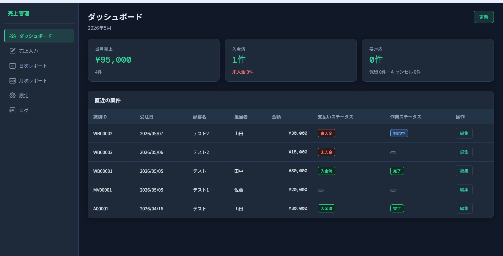
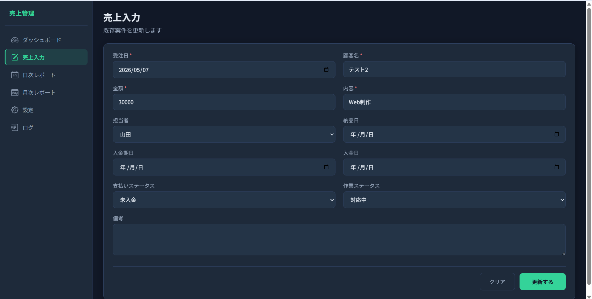
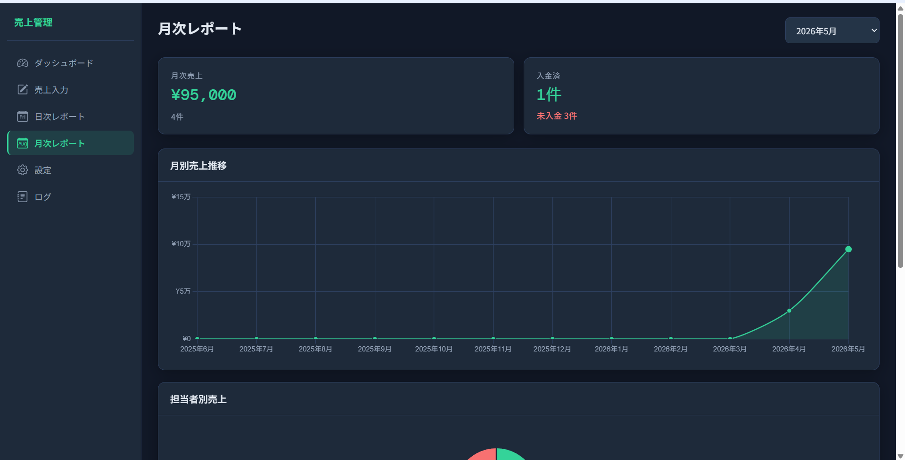
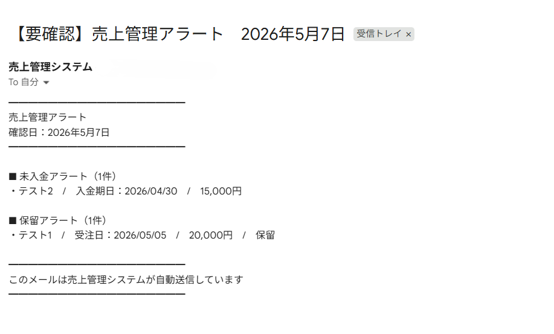
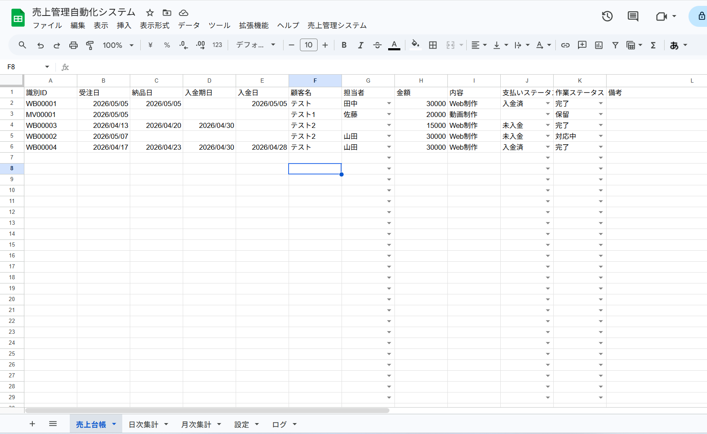

<h1>GAS 売上管理自動化システム</h1>

<div align="center">

<p><strong>「入力したら、あとはGASがやっておいてくれる」売上管理の仕組みをつくりました</strong></p>

<p>


</p>

<p><strong>売上入力〜集計〜ステータス更新〜通知まで、一連の手作業をGASで自動化した統合管理ツールです</strong></p>

<p><strong>注意</strong>: このリポジトリはポートフォリオ用です。ソースコードは非公開です。</p>

</div>

---

## 📖 目次

- [システム概要](#システム概要)
- [開発背景](#開発背景)
- [主な機能](#主な機能)
- [画面イメージ](#画面イメージ)
- [システムの流れ](#システムの流れ)
- [技術的な工夫](#技術的な工夫)
- [技術スタック](#技術スタック)
- [開発情報](#開発情報)
- [学びと強み](#学びと強み)
- [今後の拡張](#今後の拡張)
- [提供可能なサービス](#提供可能なサービス)
- [開発者について](#開発者について)
- [お問い合わせ](#お問い合わせ)
- [ライセンス](#ライセンス)

---

## 🎯 システム概要

Googleスプレッドシートで売上管理をしている個人・小規模事業者向けに、GASによる自動化の仕組みを構築したシステムです。

| 特徴 | 内容 |
|------|------|
| 🔄 入力トリガー | データを入れると識別IDを自動採番、プルダウンも自動設定 |
| 📊 自動集計 | 日次・月次の売上集計をタイムトリガーで自動実行 |
| 📧 自動通知 | 集計結果・未入金アラートをGmailで自動送信 |
| 🖥️ Web UI | スプレッドシートを開かずブラウザから操作できるダッシュボード |

**対象ユーザー**

| ユーザー | 課題 |
|---------|------|
| 個人事業主 | 売上の集計・入金管理を毎月手作業で行っている |
| 小規模事業者 | スタッフ別の実績確認に時間がかかる |
| フリーランス | 未入金案件の把握が後手に回りやすい |

**プロジェクト規模**

- 開発期間：約3週間
- GASファイル数：10ファイル（config / menu / setup / input / daily / monthly / alert / mailer / logger / trigger）
- Webアプリ：ダッシュボード・売上入力・日次レポート・月次レポート・設定・ログの6画面
- シート構成：売上台帳 / 日次集計 / 月次集計 / 設定 / ログ

---

## 💡 開発背景

### 解決した課題

**🔴 課題1：集計作業が毎日・毎月の負担になっている**
売上データを入力したあと、日次・月次の集計を手作業で行うため時間がかかる。
→ GASのタイムトリガーで集計・メール送信を完全自動化

**🔴 課題2：未入金案件の把握が遅れる**
入金期日を過ぎても気づかないケースがある。
→ 毎日定時に台帳を自動チェックし、未入金案件のみアラートメールを送信

**🔴 課題3：スプレッドシートを開かないと状況がわからない**
外出先やスマートフォンから現状を確認しづらい。
→ GAS Webアプリとして専用ダッシュボードUIを実装

**🔴 課題4：設定変更のたびにコードを触る必要がある**
通知時間や担当者リストを変えるたびに開発者に依頼が必要。
→ 設定シートとWebUI設定画面から、コード不要で全設定を変更可能

---

## ✨ 主な機能

### 🔧 機能0：初回セットアップ（シート自動生成）
- メニューから「初回セットアップ実行」を選ぶだけで5シートを自動生成
- ヘッダー・プルダウン・デフォルト値まで自動設定
- 2回目以降の実行でも既存データを破壊しない

> **工夫ポイント**：スプレッドシートを渡したクライアントが「GASエディタを触らずに」運用を始められる設計にしました。

### 📝 機能1：入力補助（識別ID自動採番）
- 売上台帳に行を入力すると識別IDを自動採番
- 採番モードは「固定 / 案件種類別 / 担当者別」の3種類を設定シートで切り替え可能
- プルダウン（担当者・ステータス）も設定シートと常に連動

### 📊 機能2・3：日次・月次集計
- 毎日・毎月、指定時間に売上台帳を自動集計してシートに書き込む
- 休業曜日・除外日は設定シートでノーコード管理
- 手動での集計実行にも対応（メニューから即時実行可能）

### 📧 機能4・5：Gmail自動通知（5パターン）
- 日次売上レポート（営業日のみ送信）
- 月次売上レポート（担当者別内訳付き）
- 未入金アラート / 保留アラート / キャンセルアラート（対象なし時は送信しない）

> **工夫ポイント**：アラートは「対象案件がゼロの日はメールを送らない」設計にして、受信者の負担を減らしています。

### 📋 機能6：ログ記録・エラー通知
- 全処理の実行結果をログシートに自動記録
- エラー発生時はGmailで管理者に即座に通知

### ⚙️ 機能7：設定シート完全連動
- コードを一切触らずシートのみで全設定を変更可能
- 通知時間・ステータス選択肢・担当者リスト・採番モードをシートで管理

### ⏰ 機能8：カスタムメニュー
- スプレッドシートのメニューから全機能を操作可能
- トリガーの設定・削除もメニューから実行

### 🖥️ 機能9：GAS Webアプリ（ダッシュボードUI）
- ダッシュボード・売上入力・日次レポート・月次レポート・設定・ログの6画面
- PC/タブレット/スマートフォン対応（レスポンシブ設計）
- Chart.jsによる月別推移グラフ・担当者別ドーナツチャート

---

## 📸 画面イメージ

### ダッシュボード画面

<div align="center">
  
</div>

当月売上・入金状況・要対応件数をカードで一覧表示。直近10件の案件も確認できます。

---

### 売上入力画面

<div align="center">
  
</div>

必須項目を入力すると識別IDが自動採番されてスプレッドシートに書き込まれます。

---

### 月次レポート画面

<div align="center">
  
</div>

月別売上推移グラフと担当者別ドーナツチャートで視覚的に把握できます。

---

### Gmailアラートメール

<div align="center">
  
</div>

未入金・保留・キャンセルの案件がある日のみ、件名・対象案件一覧つきでメールが届きます。

---

### スプレッドシート（売上台帳・設定シート）

<div align="center">
  
</div>

設定シートのみで通知時間・ステータス選択肢・採番モードを管理します。

---

## 🧩 システムの流れ
```
【入力】
スプレッドシートに売上を1行入力
↓ onEdit トリガー
識別IDを自動採番・プルダウンを自動適用
【定時自動処理】毎日・指定時間
↓ タイムトリガー
① ステータス自動判定（未入金期日超過を検出）
② 日次集計（当日の件数・金額を集計シートへ）
③ Gmail通知（日次レポート送信 / アラートがあればアラートメール）
↓ ログシートへ記録
【月末処理】毎月・指定日
↓ タイムトリガー
④ 月次集計（担当者別内訳含む）
⑤ Gmail通知（月次レポート送信）
↓ ログシートへ記録
【手動操作】カスタムメニュー or WebアプリUI
↓
任意タイミングで即時実行・設定変更が可能
```

---

## 🔧 技術的な工夫

### 工夫1：タイムゾーン問題を安全に処理

**課題**：スプレッドシートの日付セルは環境によって`Date`オブジェクトや文字列で混在して返ってくる

**解決策**：`parseLedgerOrderDate_()` を共通関数として定義し、`Date`・文字列どちらでも`yyyy/MM/dd`形式に正規化してから比較するよう統一

**効果**：日付のずれによる集計ミスをゼロに

---

### 工夫2：設定シートとコードを完全分離

**課題**：通知時間や担当者を変えるたびにGASコードを修正する必要がある

**解決策**：`getSettingValue(label)` 汎用関数ですべての設定値を設定シートから参照。コードに固定値を持たない設計に

**効果**：クライアントがGASエディタを触ることなく運用設定を変更できる

---

### 工夫3：WebアプリとスプレッドシートのUI二重対応

**課題**：スプレッドシートを開かなければ状況確認できない

**解決策**：`doGet()` でHTMLを返すGAS Webアプリとして実装。`google.script.run` で非同期にバックエンド関数を呼び出し、リアルタイムでデータを表示

**効果**：スマートフォンを含む任意のデバイスからダッシュボードと売上入力が可能に

---

## 🛠 技術スタック

| 項目 | 技術 | 採用理由 |
|------|------|----------|
| バックエンド | Google Apps Script | クライアントがGoogleスプレッドシートを使用中で追加コストゼロ |
| データ管理 | Google スプレッドシート | 非エンジニアが直接確認・操作できる |
| メール通知 | Gmail API (GmailApp) | GAS標準で認証不要・追加設定なし |
| Web UI | HTML / CSS / JavaScript (GAS HtmlService) | サーバーレス・別途ホスティング不要 |
| グラフ | Chart.js | CDN経由で追加インストール不要 |
| スケジュール | GASタイムトリガー | クラウド上で自動実行・サーバー管理不要 |

---

## 📊 開発情報

| 項目 | 内容 |
|------|------|
| 開発期間 | 約3日 |
| 開発体制 | 個人開発（AI活用） |
| GASファイル数 | 10ファイル |
| 実装画面数 | 6画面（Webアプリ） |

クラウドソーシングサイトでの案件応募をきっかけに、試作・検証として開発しました。売上管理を手動で行っている個人・小規模事業者のニーズを想定し、「コードを触らずに運用できる」ことを設計の中心に置いて実装しました。GASによるトリガー処理・外部サービス連携・Webアプリ化のスキルと、ノーコード運用への要件整理・実装経験を得ることができました。

---

## 🎓 学びと強み

### このプロジェクトで学んだこと

#### 技術面
- GASのイベントドリブン型トリガー（`onEdit` / タイムトリガー）の実装
- `HtmlService` を使ったGAS Webアプリの構築と `google.script.run` による非同期通信
- Chart.jsを使ったグラフの動的描画
- シートAPIの効率的な利用（`getValues()` の一括取得でAPIコール最小化）
- タイムゾーンを考慮した日付処理

#### 要件定義・設計面
- 「コードを触らずに運用できる」という非エンジニア向け要件を設計に落とし込む経験
- 機能をMVP（最初に動かす最小構成）→第2フェーズ→第3フェーズと段階的に整理する優先順位付け
- エラーハンドリングとログ記録の設計

### 得たスキル
- [x] GASトリガー（イベント駆動型・時間主導型）の実装
- [x] GAS Webアプリ（doGet・google.script.run）の実装
- [x] Gmail API による自動メール送信
- [x] Chart.js によるグラフ描画
- [x] 非エンジニア向けノーコード運用設計

---

## 🚀 今後の拡張

- [ ] LINE Notify連携（メール以外の通知チャネル追加）
- [ ] 請求書の自動生成・PDF出力
- [ ] 案件ステータスのガントチャート表示
- [ ] スマートフォンからの写真・領収書添付機能
- [ ] 売上目標の設定と達成率の可視化

---

## 💼 提供可能なサービス

1. **GAS業務自動化ツールの新規開発**
   - 売上管理・顧客管理・在庫管理などスプレッドシートを使った業務の自動化
   - > 「どんな作業を自動化したいか」という段階からヒアリングして設計します

2. **既存スプレッドシートへのGAS追加**
   - 現在お使いのスプレッドシートにトリガー・集計・通知の仕組みを追加
   - > 作り直しではなく既存環境への追加対応も可能です

3. **GAS Webアプリ開発**
   - スプレッドシートに紐付いた操作UIの構築

※ 現在はポートフォリオ用途として段階的に開発・検証を行っており、提供形態や範囲については個別検討ベースとなります。

---

## 👤 開発者について

**制作者**: Misako

前職は金融機関で顧客管理システムを日々利用していました。「なぜこんなに手作業が多いのか」という現場の違和感が、業務効率化への関心の出発点です。現在は個人事業主として活動しながら、GASを中心にAIツールを活用した開発を実践中です。

**得意・関心分野**
- GASを使った業務効率化・自動化
- 非エンジニアでも使いやすいUI設計
- 小規模事業者の実務フローに合わせたシステム設計

**こんな方のご相談に向いています**
- 「毎月の集計が面倒で自動化したい」
- 「スプレッドシートで管理しているが、もっと楽にしたい」
- 「GASで何ができるか相談したい」

---

## 📩 お問い合わせ

#### 📩 公式LINE（推奨）

[👉 公式LINEで問い合わせる](https://lin.ee/LQKST5q)

- **気軽にご相談いただけます**（24時間受付）
- レスポンス：原則24時間以内

#### 💼 クラウドソーシングサイト

- [ランサーズ](https://www.lancers.jp/profile/Mi1103)
- [クラウドワークス](https://crowdworks.jp/public/employees/6463085)
- [ココナラ](https://coconala.com/users/5336527)

「こんなこと相談していいのかな？」という段階からでも大歓迎です。

---

## 📄 ライセンス

このシステムのソースコードは非公開です。ポートフォリオ用のREADME・画像は閲覧のみ可能です。

導入・カスタマイズをご希望の場合は、お問い合わせください。

---

<div align="center">

<p><strong>「入力したら、あとはGASがやっておいてくれる」売上管理の仕組みをつくりました</strong></p>

<hr>

<p>
<strong>制作者</strong>: Misako<br>
<strong>制作時期</strong>: 2026年5月<br>
<strong>技術スタック</strong>: Google Apps Script / Google スプレッドシート / Gmail API / HTML・CSS・JS / Chart.js
</p>

<hr>

<p>
⭐ このプロジェクトが参考になりましたら、Starをいただけると嬉しいです<br>
📢 シェア・拡散も大歓迎です
</p>

<hr>

<p><em>最終更新日: 2026年5月</em></p>

</div>
