# Salon AI Assistant

<p>
  
  
  
  
  
  
  
</p>

---

## 概要

**美容室向け LINE AI 自動応答・問い合わせ管理システム**

美容室で繰り返し発生する LINE 問い合わせへの対応を AI で自動化し、オーナーの業務負担を軽減する Web アプリケーションです。

営業時間・料金・施術内容などのよくある質問には AI が自動応答し、判断が難しい問い合わせのみオーナーへエスカレーションします。

管理画面から FAQ・メニュー・お知らせ配信までスマートフォンで運用できるよう設計しています。

## ✨ 主な特徴

- 🤖 Claude API による自然な LINE 自動応答
- 💬 AI が回答できない質問はオーナーへ自動通知
- 📱 スマートフォンで完結する管理画面
- 📝 FAQ・料金・メニューをノーコードで更新
- 📢 LINE お知らせ一斉配信
- 📊 会話ログ・個別返信機能
- 💰 無料サービスを活用した低コスト構成

---

## Demo


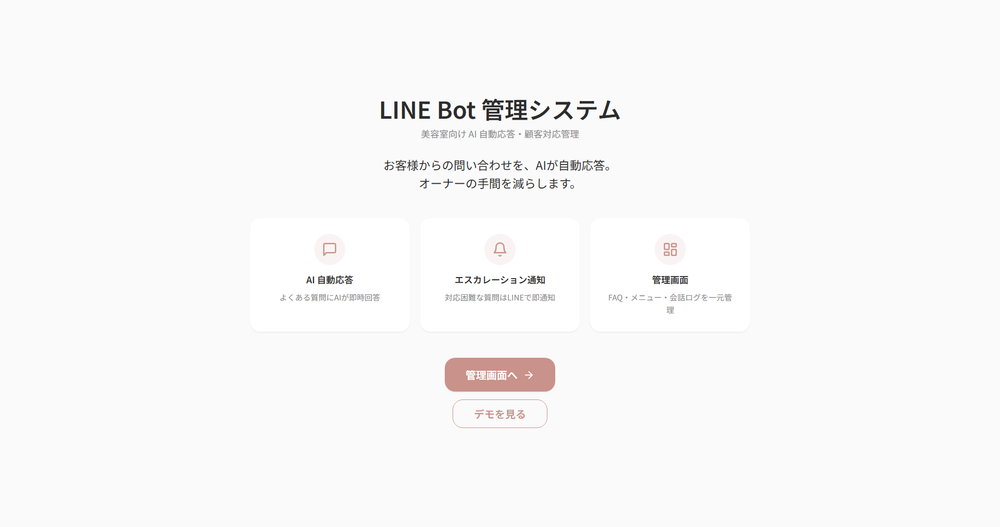

---

## 開発背景

個人経営の美容室では、

- 営業時間
- メニュー・料金
- 駐車場
- 施術内容

など、同じ内容の問い合わせが LINE で何度も繰り返されます。

営業時間中は施術を優先するため返信が遅れることも多く、営業時間外の問い合わせにも対応する必要があるなど、問い合わせ対応はオーナーにとって日常的な負担となっています。

そこで本プロジェクトでは、AI による自動応答と、人による対応を組み合わせた運用を前提とした LINE 問い合わせ管理システムを設計・開発しました。

課題整理から要件定義、UI/UX 設計、データベース設計、実装、テスト、デプロイまで一連の開発プロセスを意識し、実運用を想定した構成としています。

---

## 主な機能

| 機能 | 説明 |
| --- | --- |
| **AI 自動応答** | Claude Sonnet 4.6 が FAQ + メニューを system prompt に注入して即答（平均 2.6 秒） |
| **FAQ 管理** | 質問・回答・カテゴリを管理画面で CRUD。変更はキャッシュ即失効で bot に反映 |
| **メニュー・料金管理** | 料金は `menus` テーブルを単一情報源として管理し、FAQ との重複を排除 |
| **会話ログ管理** | 全会話を記録、確信度（high/mid/low）バッジで可視化 |
| **エスカレーション通知** | 確信度 low の質問はオーナーの LINE に自動通知 |
| **オーナー個別返信** | 会話ログ画面から直接 LINE Push で返信、`replied_at` で二重返信防止 |
| **一斉配信** | LINE broadcast API で友だち全員に配信（プレビュー & 確認モーダル付き） |
| **デモモード** | 認証不要の `/demo` で全機能をモック体験（useState で完結） |
| **管理者ホワイトリスト認証** | Google OAuth + `ADMIN_EMAILS` 環境変数でアクセス制限 |

---

## システム構成図

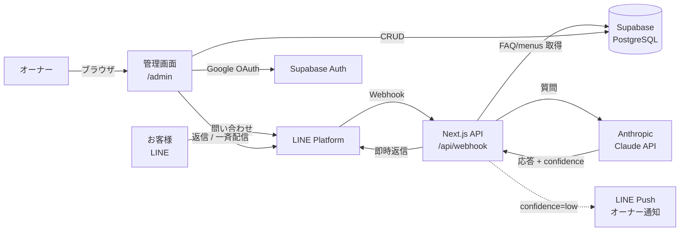

---

## 技術スタック

| 領域 | 技術 |
| --- | --- |
| **Frontend** | Next.js 14 (App Router) / React 18 / TypeScript 5 |
| **UI** | Tailwind CSS 3 / Noto Sans JP / Lucide Icons |
| **Backend** | Next.js Route Handlers |
| **Database** | Supabase (PostgreSQL 15 + RLS) |
| **認証** | Supabase Auth (Google OAuth) + email allowlist middleware |
| **AI** | Anthropic Claude Sonnet 4.6 (`@anthropic-ai/sdk`) |
| **メッセージング** | LINE Messaging API (`@line/bot-sdk`) |
| **ホスティング** | Vercel (Serverless Functions) |
| **主要ライブラリ** | `@supabase/ssr`, `@vercel/functions` (`waitUntil`), lucide-react |

---

## 📱 画面イメージ

> 主な画面を掲載しています。その他の画面は折りたたみ内でご覧いただけます。

### 管理画面ダッシュボード

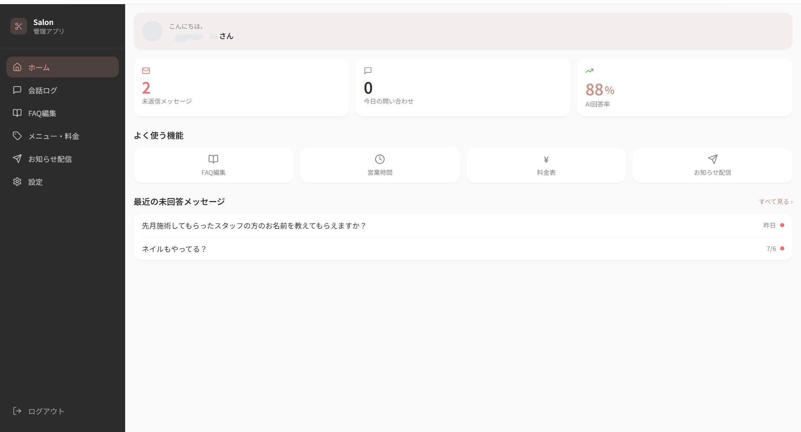

未返信件数・今日の問い合わせ件数・AI回答率などをダッシュボードで一目で確認できます。

---

| ログイン | FAQ管理 |
| :---: | :---: |
| 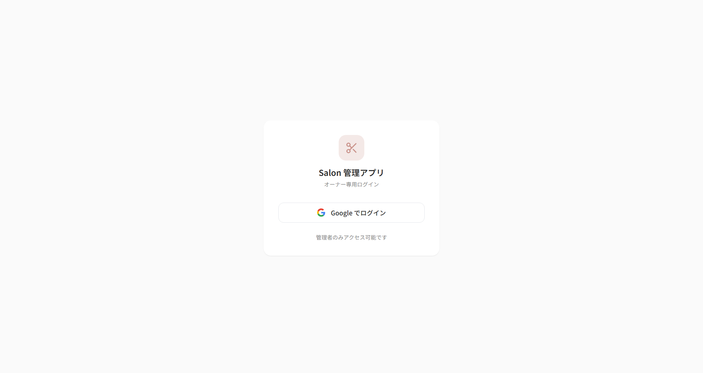 | 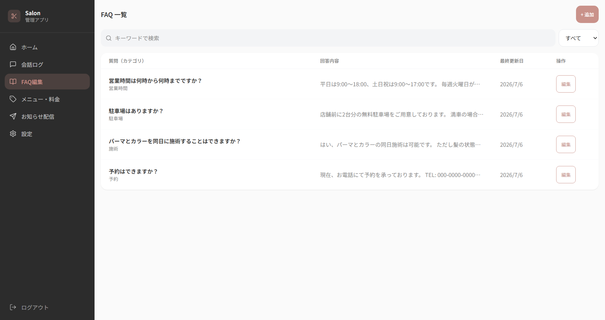 |

Googleアカウントで安全にログイン。FAQは管理画面から追加・編集・削除でき、更新内容はすぐAIへ反映されます。

---

| 会話ログ | お知らせ配信 |
| :---: | :---: |
| 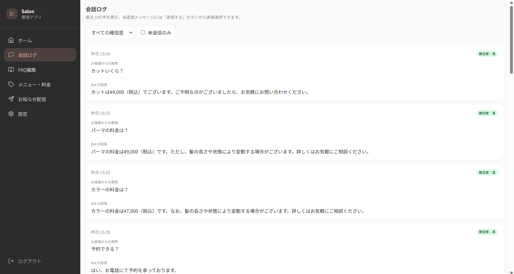 | 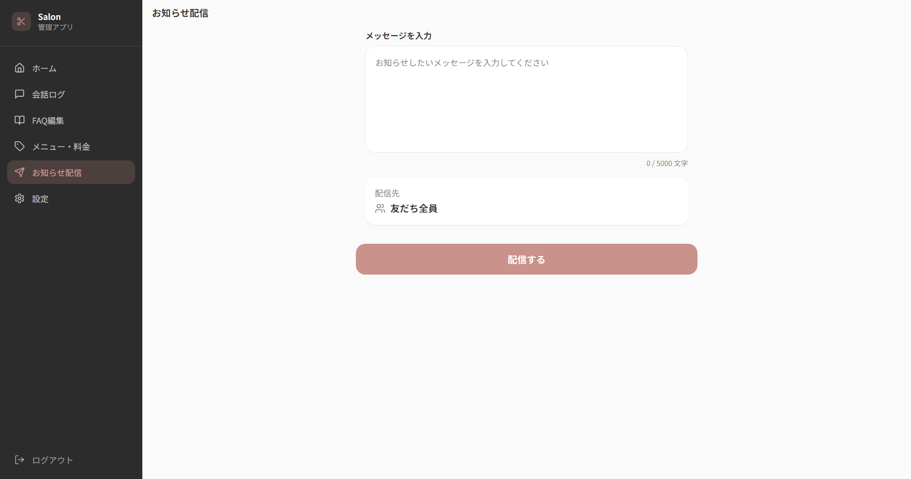 |

AIとの会話履歴や未返信状況を一覧管理。営業時間変更や臨時休業などのお知らせもLINEへ一斉配信できます。

---

<details>

<summary><strong>その他の画面を見る</strong></summary>

### FAQ追加・編集

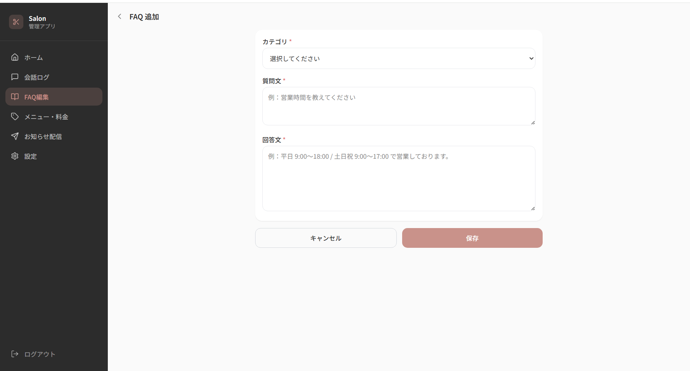

FAQをモーダル画面から追加・編集・削除できます。コードを書かずに運用者自身で更新できます。

---

### メニュー・料金管理

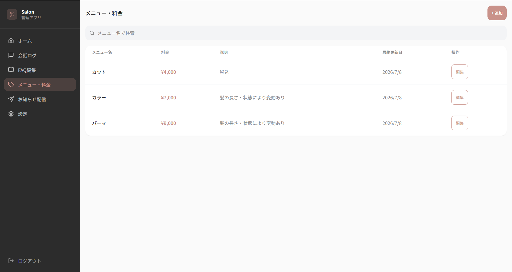

施術メニュー・料金を一元管理。変更内容はAI回答にも自動反映されます。

---

### 個別返信

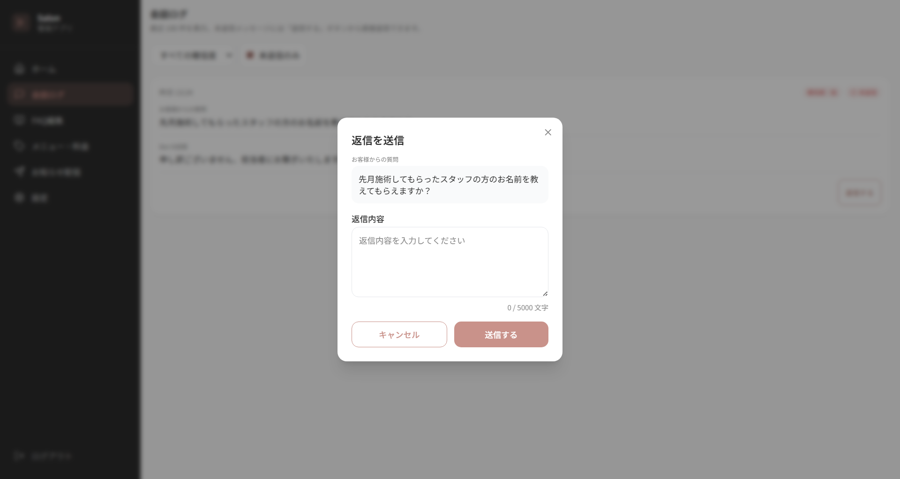

AIで対応できなかった問い合わせは管理画面から直接LINEへ返信できます。

---

### LINEでの自動応答

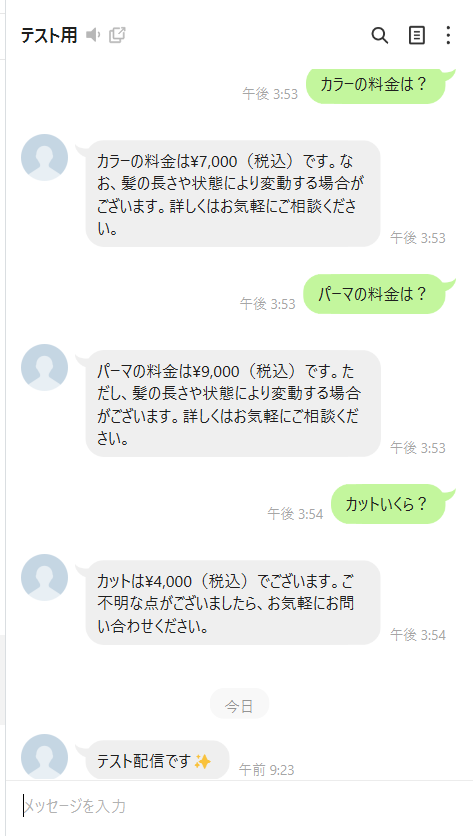

お客様側のLINE画面です。FAQに該当する質問はAIが即座に回答します。

---

### エスカレーション通知

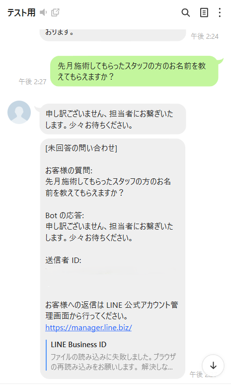

AIで回答できない内容はオーナーへ自動通知し、人による対応へスムーズに引き継ぎます。

---

### モバイル表示（レスポンシブ）

<p align="center">
  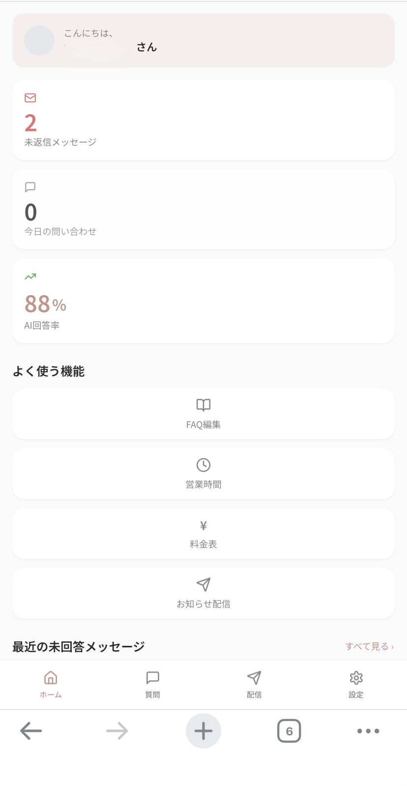
</p>

スマートフォンでの利用を前提に設計し、店舗内や外出先でも快適に操作できます。

---

### デモモード

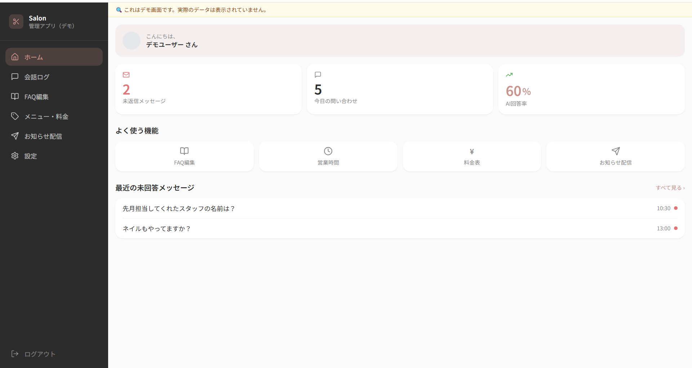

認証不要のデモ画面を用意しており、ダミーデータを使って主要機能を体験できます。

</details>

---

## データベース

Supabase（PostgreSQL）に 3 テーブル。すべて `id` は UUID、RLS 有効化済み。

| テーブル | 用途 | 主要カラム |
| --- | --- | --- |
| `faq` | よくある質問と回答 | `question`, `answer`, `category`（6 値ホワイトリスト） |
| `menus` | メニュー・料金の単一情報源 | `name`, `price`, `description` |
| `conversations` | 会話ログ | `user_line_id`, `message`, `response`, `confidence`, `escalated`, `replied_at` |

- `faq.category` は `('営業時間', '料金', '駐車場', '施術', '予約', 'その他')` の CHECK 制約
- `conversations.replied_at` を timestamptz で持ち、管理画面返信の永続化に利用
- `updated_at` は trigger で自動更新（`search_path=''` で SECURITY DEFINER）

---

## 開発プロセス

本プロジェクトでは、課題整理から要件定義、UI/UX 設計、データベース設計、実装、テスト、デプロイまで、一連の開発プロセスを意識して開発を進めました。

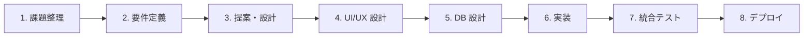

| フェーズ | 内容 |
| --- | --- |
| 課題整理 | ユーザー課題・業務課題を整理 |
| 要件定義 | MVP・対象範囲・将来拡張を明確化 |
| 提案・設計 | システム構成・技術選定・画面構成を設計 |
| UI/UX 設計 | モバイルファーストで画面設計 |
| データベース設計 | テーブル・RLS・データ構造を設計 |
| 実装 | フロント・バックエンド・LINE 連携・AI 連携 |
| 統合テスト | LINE 実機・AI 応答・通知・管理画面を検証 |
| デプロイ | Vercel・Supabase・LINE Bot 環境へ公開 |

---

## 工夫した点

- **AI と人を組み合わせた運用設計**
  - AI だけに任せるのではなく、回答が難しい問い合わせはオーナーへ自動通知することで、実運用しやすい仕組みとしました。

- **運用しやすい管理画面**
  - FAQ・メニュー・料金を管理画面から更新でき、コードを修正せず情報を変更できるよう設計しました。

- **低コストで導入しやすい構成**
  - Vercel・Supabase 無料プランを活用し、小規模店舗でも導入しやすいシステム構成としています。

- **スマートフォン中心の UI/UX**
  - モバイルファーストで設計し、レスポンシブ対応・視認性・操作性を重視しました。

- **データの一元管理**
  - メニュー・料金情報をデータベースで一元管理し、AI 回答との整合性を保ちやすい設計としました。

- **応答速度への配慮**
  - FAQ 情報をキャッシュすることで AI 応答時間を短縮し、快適な操作性を実現しています。

---

## 今後の改善

現在は問い合わせ対応の自動化を中心としたシステムですが、将来的には予約受付まで一元管理できるシステムへ発展させることを想定しています。

- LINE からの予約受付
- 空き状況の自動回答
- 予約管理機能

---

## セットアップ

### 前提

- Node.js 18 以上
- npm
- Supabase / LINE Developers / Anthropic / Google Cloud のアカウント

### 手順

```bash
# 1. リポジトリを clone
git clone https://github.com/<owner>/salon-line-bot.git
cd salon-line-bot

# 2. 依存パッケージをインストール
npm install

# 3. .env.local を作成（下記の .env.example を参考に）
cp .env.local.example .env.local
# → 各値を実際のキーで埋める

# 4. 開発サーバー起動
npm run dev
# → http://localhost:3000
```

### `.env.example`

```bash
# LINE Messaging API
LINE_CHANNEL_SECRET=your_line_channel_secret_here
LINE_CHANNEL_ACCESS_TOKEN=your_line_channel_access_token_here
LINE_OWNER_USER_ID=Uxxxxxxxxxxxxxxxxxxxxxxxxxxxxxxx

# Anthropic Claude API
ANTHROPIC_API_KEY=sk-ant-your_key_here
CLAUDE_MODEL=claude-sonnet-4-6

# Supabase
NEXT_PUBLIC_SUPABASE_URL=https://your_project_ref.supabase.co
NEXT_PUBLIC_SUPABASE_ANON_KEY=your_anon_key_here
SUPABASE_SERVICE_ROLE_KEY=your_service_role_key_here

# 内部 API 保護
CHAT_API_SECRET=32文字以上のランダム文字列

# 管理画面ホワイトリスト（カンマ区切り）
ADMIN_EMAILS=owner@example.com,dev@example.com
```

### スクリプト

```bash
npm run dev         # 開発サーバー
npm run build       # 本番ビルド
npm run start       # 本番起動
npm run lint        # ESLint
npm run type-check  # TypeScript 型チェック
```

---

## ディレクトリ構成

```
salon-line-bot/
├── app/
│   ├── page.tsx                        # ランディングページ（公開）
│   ├── layout.tsx                      # Noto Sans JP 読み込み
│   ├── admin/
│   │   ├── login/                      # Google ログイン画面
│   │   ├── auth/                       # OAuth コールバック / signout
│   │   └── (dashboard)/                # 認証ゲート後の共通レイアウト
│   │       ├── layout.tsx              # Sidebar + BottomNav
│   │       ├── page.tsx                # ホーム（KPI）
│   │       ├── faq/                    # FAQ CRUD
│   │       ├── menus/                  # メニュー CRUD
│   │       ├── conversations/          # 会話ログ + 返信モーダル
│   │       ├── broadcast/              # 一斉配信
│   │       └── settings/               # 設定・ログアウト
│   ├── demo/                           # 認証不要のショールーム版
│   │   ├── layout.tsx
│   │   ├── page.tsx
│   │   ├── faq / menus / conversations / broadcast / settings
│   └── api/
│       ├── webhook/                    # LINE Webhook 受信
│       ├── chat/                       # 内部 chat API
│       └── admin/
│           ├── faq/ + [id]/            # FAQ POST / PUT / DELETE
│           ├── menus/ + [id]/          # メニュー POST / PUT / DELETE
│           ├── broadcast/              # 一斉配信 POST
│           └── reply/                  # 個別返信 POST
├── lib/
│   ├── chat.ts                         # generateChatResponse (Claude 呼出)
│   ├── anthropic.ts                    # Claude client
│   ├── supabase.ts                     # service_role client
│   ├── supabase-server.ts              # cookies ベース Server 用
│   ├── supabase-browser.ts             # Client Component 用
│   └── demo-data.ts                    # /demo 用静的データ
├── middleware.ts                       # /admin 認証 + ADMIN_EMAILS 判定
├── tailwind.config.ts                  # ブランドカラー 7 色
├── .env.local.example
└── package.json
```

---

## 注意事項

本アプリはポートフォリオとして開発した作品です。

開発時には Vercel・Supabase へデプロイし、LINE 実機による動作確認を実施しています。

現在は Supabase 無料プランの運用都合により、バックエンド環境を停止または削除している場合があります。

---

<p align="center">
  <sub>Built with Next.js, Supabase, and Claude API.</sub>
</p>

