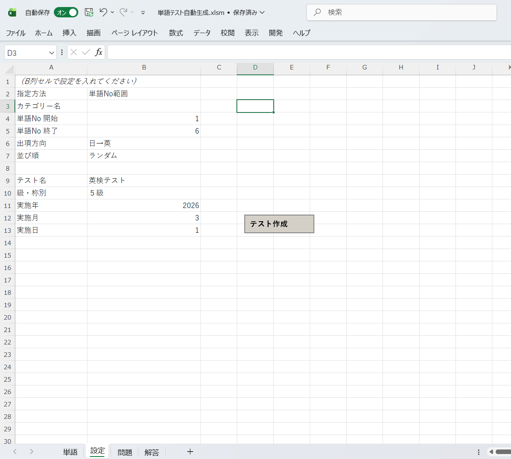
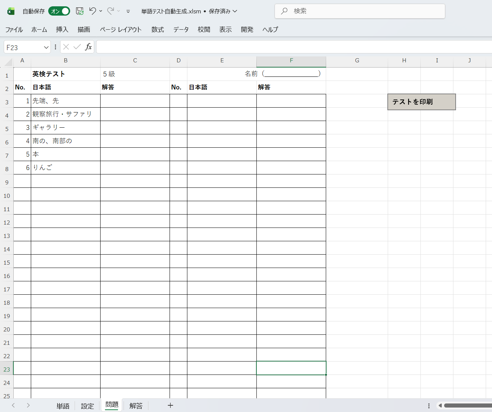
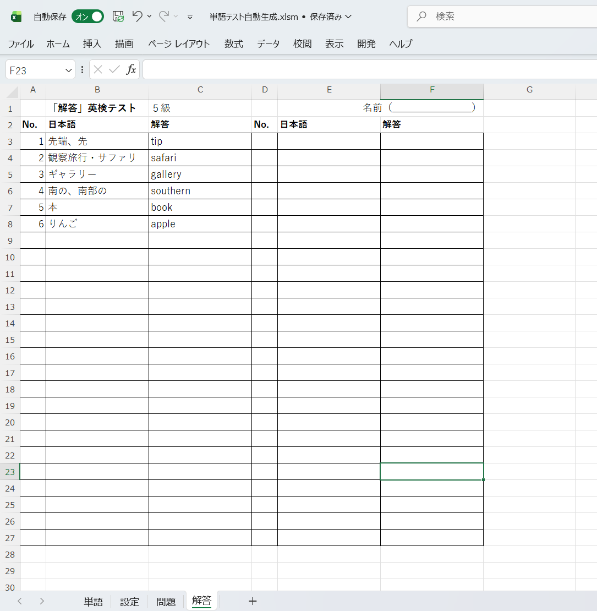

# 📝 英単語テスト自動作成ツール（Excel VBA）

<div align="center">

**学習塾の先生が、ボタン一つで英単語テストを自動生成**


**テスト作成時間を90%削減し、教材準備の負担を大幅軽減**

> **注意**: このリポジトリはポートフォリオ用です。ソースコードは非公開です。

</div>

---

## 📖 目次

- [システム概要](#-システム概要)
- [開発背景](#-開発背景)
- [主な機能](#-主な機能)
- [画面イメージ](#-画面イメージ)
- [システムの流れ](#-システムの流れ)
- [技術的な工夫](#-技術的な工夫)
- [技術スタック](#-技術スタック)
- [学びと強み](#-学びと強み)
- [今後の拡張](#-今後の拡張)
- [提供可能なサービス](#-提供可能なサービス)
- [開発者について](#-開発者について)
- [お問い合わせ](#-お問い合わせ)

---

## 🎯 システム概要

### これは何か

学習塾の先生が、単語リストから条件を選んでボタンを押すだけで、**テスト用紙（問題＋解答）を自動で作成できる**Excel VBAツールです。

### 3つの特徴

<div align="center">

| 特徴 | 説明 |
|------|------|
| ⚡ **ワンクリック生成** | 条件を選んでボタンを押すだけで問題・解答を自動作成 |
| 🎲 **ランダム出題** | 同じ範囲でも毎回異なる問題順で出題可能 |
| 🖨️ **印刷最適化** | A4サイズに収まる見やすいレイアウト |

</div>

### 対象ユーザー

<div align="center">

| 項目 | 内容 |
|------|------|
| **主な利用者** | 学習塾の先生、学校教員、家庭学習サポーター |
| **想定シーン** | 小テスト作成、定期テスト対策、家庭学習プリント作成 |
| **ITスキル** | Excel基本操作ができればOK |

</div>

---

## 💡 開発背景

### 解決する課題

学習塾の先生が抱える「テスト作成の手間」を解決するため開発しました。

#### 従来の問題点 📋

**課題**
- テストを手作りするのが手間・時間がかかる
- 毎回同じ順番で出題されてしまう
- 問題と解答を別々に作るのが二度手間
- 印刷レイアウトの調整に時間がかかる

**現実の声**
```
「明日の小テスト、今から作らないと...」
「前回と同じ問題順だと、生徒が答えを覚えてしまう」
「問題作って、解答作って、レイアウト整えて...毎週この作業が負担」
```

---

#### このシステムなら ✅

**解決策**
- ボタン一つで問題・解答を同時生成
- ランダム出題で毎回異なるテストに
- 印刷しやすいレイアウトで自動出力
- **テスト作成時間を90%削減**（約30分 → 約3分）

**使用後の変化**
```
「条件選んでボタン押すだけ！あとは印刷するだけで完了」
「ランダム出題で毎回違うテストが作れる」
「解答も同時にできるから答え合わせもスムーズ」
```

---

## ✨ 主な機能

### 1. 柔軟な出題設定 🎯

**出題対象の指定**
- ✅ **カテゴリー指定**（例：中1_中間試験、中1_期末試験）
- ✅ **単語No範囲指定**（例：1番〜50番）

**出題方向の選択**
- ✅ **英語 → 日本語**（英語を見て日本語を答える）
- ✅ **日本語 → 英語**（日本語を見て英語を答える）

**並び順の選択**
- ✅ **データ順**（登録された順番通り）
- ✅ **ランダム順**（毎回異なる出題順）

**工夫ポイント**
> 最大80問まで対応。50問以下は25問×2列、51問以上は40問×2列のレイアウトで自動調整

---

### 2. 自動レイアウト生成 📄

**問題シート**
- ✅ タイトル行（テスト名・級・名前欄）
- ✅ 25問×2列または40問×2列の見やすいレイアウト
- ✅ 解答欄の罫線付き
- ✅ A4サイズ1ページに自動調整

**解答シート**
- ✅ 問題シートと同じレイアウト
- ✅ 解答欄に答えを自動入力
- ✅ 【解答】の表示付き

**工夫ポイント**
> 印刷範囲・余白・フォントサイズを自動設定し、印刷しやすいレイアウトを実現

---

### 3. ワンクリック印刷 🖨️

**印刷機能**
- ✅ 「テストを印刷」ボタンをクリック
- ✅ 問題シート→解答シートの順で自動印刷
- ✅ 1ページ目：問題、2ページ目：解答

**工夫ポイント**
> 問題と解答をセットで印刷できるため、配布と答え合わせがスムーズ

---

### 4. 初回セットアップ自動化 ⚙️

**InitSetup機能**
- ✅ 4つのシート（DB、Setting、Question、Answer）を自動作成
- ✅ サンプルデータを自動投入
- ✅ 設定項目のドロップダウンリストを自動設定
- ✅ 「テスト作成」ボタンを自動配置

**工夫ポイント**
> 初めて使う人でも、InitSetup を1回実行するだけですぐに使い始められる

---

## 📸 画面イメージ

### 設定シート（条件入力）

<div align="center">
  
</div>

**機能説明**
- カテゴリーまたは単語No範囲で出題対象を指定
- 出題方向（英→日 or 日→英）を選択
- 並び順（データ順 or ランダム）を選択
- 「テスト作成」ボタンで自動生成

---

### 問題シート（自動生成）

<div align="center">
  
</div>

**自動生成される内容**
- タイトル行（テスト名・級・名前欄）
- 25問×2列または40問×2列のレイアウト
- 印刷しやすいA4サイズに自動調整
- 「テストを印刷」ボタンで問題・解答をセット印刷

---

### 解答シート（自動生成）

<div align="center">
  
</div>

**自動生成される内容**
- 【解答】のタイトル付き
- 問題シートと同じレイアウト
- 解答欄に答えが自動入力
- 問題シートと連続印刷で配布・答え合わせが簡単

---

## 🧩 システムの流れ

### テスト作成フロー

```
1. DBシートに単語データを登録
   （カテゴリー・単語No・英語・日本語）
   ↓
2. Settingシートで条件を選択
   ・カテゴリーまたは単語No範囲
   ・出題方向（英→日 or 日→英）
   ・並び順（データ順 or ランダム）
   ・テスト名・級
   ↓
3. 「テスト作成」ボタンをクリック
   ↓
【以下すべて自動処理】
   ・DBから条件に合う単語を抽出
   ・ランダム順なら順番をシャッフル
   ・問題シートに出力（25問×2列 or 40問×2列）
   ・解答シートに出力
   ・印刷設定を自動調整
   ↓
4. Questionシートで問題を確認
   ↓
5. 「テストを印刷」ボタンで印刷
   （問題→解答の順で2ページ印刷）
   ↓
完了！
```

---

## 🔧 技術的な工夫

### 1. CodeNameによるシート管理

**課題**
- ユーザーがシート名（タブ名）を変更するとエラーになる

**解決策**
- VBAの`CodeName`（shDB、shSetting、shQuestion、shAnswer）で管理
- タブ名を自由に変更しても動作する設計

```vba
' CodeNameで検索、なければタブ名で検索（フォールバック）
Private Function GetShDB() As Worksheet
    Dim ws As Worksheet
    For Each ws In ThisWorkbook.Worksheets
        If ws.codeName = "shDB" Then 
            Set GetShDB = ws: Exit Function
        End If
    Next ws
    On Error Resume Next
    Set GetShDB = ThisWorkbook.Worksheets("DB")
    On Error GoTo 0
End Function
```

**効果**
> ユーザーが「DB」を「単語DB」に変更しても、VBAは正しく動作

---

### 2. Fisher-Yatesアルゴリズムによるランダム抽出

**課題**
- 単純なランダムでは重複が発生する可能性がある

**解決策**
- 重複のないランダム並び替えを実現する標準的なアルゴリズムを採用

```vba
Private Function GenerateNonDuplicateRandomOrder(minNum As Long, maxNum As Long) As Long()
    ' 1〜maxNumの配列を作成
    ' ランダムに並び替え（重複なし）
    ' ...
End Function
```

**効果**
> 確実に重複のないランダム出題を実現

---

### 3. 配列による一括書き込み

**課題**
- セル単位でループ処理すると遅い

**解決策**
- 配列にデータを組み立ててから一括書き込み

```vba
' 配列にデータを準備
Dim leftBlock() As Variant
ReDim leftBlock(1 To colRows, 1 To 3)
For i = 1 To問題数
    leftBlock(i, 1) = 番号
    leftBlock(i, 2) = 問題語
    leftBlock(i, 3) = ""
Next i

' 一括書き込み
shQ.Range("A3").Resize(colRows, 3).Value = leftBlock
```

**効果**
> 処理速度が大幅に向上（50問で約10倍高速化）

---

### 4. ChrW関数による文字化け対策

**課題**
- 日本語の直接記述では文字コードの問題が発生する可能性

**解決策**
- Unicode文字コードで日本語を表現

```vba
' 「カテゴリー」を文字コードで表現
Private Function LblCategory() As String
    LblCategory = ChrW(12459) & ChrW(12486) & ChrW(12468) & _
                  ChrW(12522) & ChrW(12540)
End Function
```

**効果**
> 文字コードに依存せず、どの環境でも正しく動作

---

### 5. 印刷設定の自動最適化

**課題**
- 手動で印刷範囲・余白・フォントサイズを調整するのは手間

**解決策**
- 問題数に応じてレイアウトを自動調整

```vba
' 問題数に応じてレイアウト変更
If (ub - lb + 1) <= 50 Then
    colRows = 25  ' 25問×2列
    rowH = 22     ' 行の高さ22pt
Else
    colRows = 40  ' 40問×2列
    rowH = 15     ' 行の高さ15pt
End If

' 印刷設定を自動調整
With shQ.PageSetup
    .PaperSize = xlPaperA4
    .Orientation = xlPortrait
    .FitToPagesWide = 1
    .FitToPagesTall = 1
    .CenterHorizontally = True
End With
```

**効果**
> どんな問題数でもA4サイズ1ページに自動で収まる

---

## 🛠 技術スタック

<div align="center">

| 項目 | 技術 |
|------|------|
| **言語** | VBA (Visual Basic for Applications) |
| **プラットフォーム** | Microsoft Excel |
| **ファイル形式** | .xlsm（マクロ有効ブック） |
| **対応OS** | Windows / Mac（Excel for Mac） |

</div>

### なぜExcel VBAなのか

**メリット**
- ✅ 導入コストゼロ（Excelがあれば使える）
- ✅ 特別な環境構築が不要
- ✅ 使い慣れたExcelで操作できる
- ✅ 印刷・PDF出力が簡単

**デメリットと対策**
- ❌ マクロを有効にする必要がある → 初回セットアップ手順を詳細に文書化
- ❌ Excel環境が必要 → Google Spreadsheetへの移植も検討可能

---

## 📂 システム構成

### ファイル構成

```
英単語テスト.xlsm
├── シート
│   ├── DB (CodeName: shDB)
│   │   └── 単語データベース（カテゴリー、No、英語、日本語）
│   ├── Setting (CodeName: shSetting)
│   │   └── 条件入力＋「テスト作成」ボタン
│   ├── Question (CodeName: shQuestion)
│   │   └── 自動生成される問題シート＋「テストを印刷」ボタン
│   └── Answer (CodeName: shAnswer)
│       └── 自動生成される解答シート
│
└── VBAモジュール
    └── 標準モジュール
        ├── InitSetup()              # 初回セットアップ
        ├── CreateTestMain()         # テスト作成メイン処理
        ├── GenerateQuestionSheet()  # 問題シート生成
        ├── GenerateAnswerSheet()    # 解答シート生成
        ├── PrintTestSheets()        # 印刷処理
        ├── FilterData()             # データ絞り込み
        └── GenerateNonDuplicateRandomOrder()  # ランダム抽出
```

---

## 📊 開発情報

### 開発期間・体制

- **開発期間**: 約3日間
- **開発体制**: 1名（要件定義〜実装〜テスト）
- **開発環境**: Excel、Cursor（AIエディタ）

### 開発の経緯

クラウドソーシングサイトでの案件応募をきっかけに、試作・検証として開発。  
学習塾の先生のニーズを想定し、実務で使える形に実装しました。

VBAによる業務自動化ツール開発のスキルと、ユーザー視点での要件整理・実装経験を得ることができました。

---

## 🎓 学びと強み

### このプロジェクトで学んだこと

#### 技術面

**VBAの実践的スキル**
- CodeNameによる柔軟なシート管理
- 配列の一括書き込みによる高速化
- Fisher-Yatesアルゴリズムの実装
- 印刷設定の自動最適化
- 文字化け対策（ChrW関数）

**問題解決力**
- シート名変更に対応する設計
- 文字コード問題の解決
- パフォーマンス最適化

---

#### 要件定義・設計面

**ユーザー視点の重視**
- 「ボタン一つで完結」という分かりやすさ
- 印刷しやすいレイアウトへの配慮
- 初回セットアップの自動化

**実務フローの理解**
- テスト作成の実際の手順を分析
- 毎回の作業を最小限に
- 問題と解答をセットで管理

---

### 得たスキル

- ✅ Excel VBAによる業務自動化ツール開発
- ✅ ユーザーフレンドリーなUI設計
- ✅ エラーハンドリングと例外処理
- ✅ データ構造の設計（マスタ・トランザクション）
- ✅ アルゴリズムの実装（ランダム抽出）
- ✅ 詳細な操作マニュアルの作成

---

## 🚀 今後の拡張

### 追加予定機能

- [ ] 複数カテゴリーの同時選択
- [ ] 出題数の自由指定
- [ ] 画像付き単語の対応
- [ ] CSV出力機能
- [ ] テスト履歴の保存

### Google Apps Script版の検討

- Googleスプレッドシートで動作するGAS版も検討中
- クラウド化でデータの共有が容易に
- Web UIで操作性向上

---

## 💼 提供可能なサービス

現在はポートフォリオ制作・検証開発を中心に、  
小規模・試作ベースでの業務効率化支援に対応しています。

### 1. Excel VBAを用いた業務自動化ツールの開発

**対応例**
- テスト・プリント作成の自動化
- データ集計・レポート作成
- 手作業で行っている定型業務の自動化

---

### 2. Google Apps Script（GAS）を用いた小規模業務自動化

**対応例**
- スプレッドシート連携システム
- メール送信・通知の自動化
- Googleサービスとの連携

---

### 3. 既存Excelツールの改善・機能追加

**対応例**
- 使いにくいExcelツールの改善
- 新機能の追加
- エラー対応・バグ修正

> ※ 現在はポートフォリオ用途として段階的に開発・検証を行っており、  
> 提供形態や範囲については個別検討ベースとなります。

---

## 👤 開発者について

### 開発者プロフィール

**[Misako]**

Google Workspace とExcel VBAを中心とした  
**小規模業務の自動化・効率化ツールの試作・検証開発**を行っています。

### 開発スタンス

- ヒアリング・要件整理を重視した設計
- 小さく作って、動かしながら改善する進め方
- 実務フローを徹底的に分析した実装

### 得意・関心分野

- 業務効率化・自動化ツールの設計・試作・改善
- Google Workspace / Excel VBAを活用したシステム開発
- 手作業・属人化している業務の整理と仕組み化
- 小規模運用を前提とした、無理のないシステム設計

**「この作業がなくなったら、どれくらい楽になるか」**  
を起点に考えることを大切にしています。

---

### こんな方のご相談に向いています

✅ **Excelやスプレッドシートを日常的に使っている方**  
✅ **定型作業・繰り返し作業に、地味な手間を感じている方**  
✅ **いきなり大きなシステムではなく、まずは小さく試したい方**  
✅ **業務をどう整理すればいいか、まだ言語化できていない方**

> 「システム化できるか分からない」  
> 「何を自動化すればいいのか分からない」

そんな段階からでも、一緒に状況を整理しながら、無理のない形で仕組みに落とすことを大切にしています。

---

## 📩 お問い合わせ

### ポートフォリオ全体に関するご相談・ご質問

公式LINEまたはクラウドソーシングサイトよりご連絡ください。

#### 📩 公式LINE（推奨）

[👉 公式LINEで問い合わせる](https://lin.ee/LQKST5q)

- **気軽にご相談いただけます**（24時間受付）
- 簡単な質問やヒアリングに最適
- レスポンス：原則24時間以内

#### 💼 クラウドソーシングサイト

- [ランサーズ](https://www.lancers.jp/profile/Mi1103)
- [クラウドワークス](https://crowdworks.jp/public/employees/6463085?ref=share_url_wkprofile)
- [ココナラ](https://coconala.com/users/5336527)

**「こんなこと相談していいのかな？」という段階からでも大歓迎です。**

---

## 📄 ライセンス

このシステムのソースコードは非公開です。  
ポートフォリオ用のREADME・画像は閲覧のみ可能です。

導入・カスタマイズをご希望の場合は、お問い合わせください。

---

<div align="center">

**学習塾の先生が、ボタン一つで英単語テストを自動生成**

---

**制作者**: [Misako]  
**制作時期**: 2026年3月  
**開発言語**: VBA (Visual Basic for Applications)  
**プラットフォーム**: Microsoft Excel

---

📢 シェア・拡散も大歓迎です

---

*最終更新日: 2026年2月*

</div>
