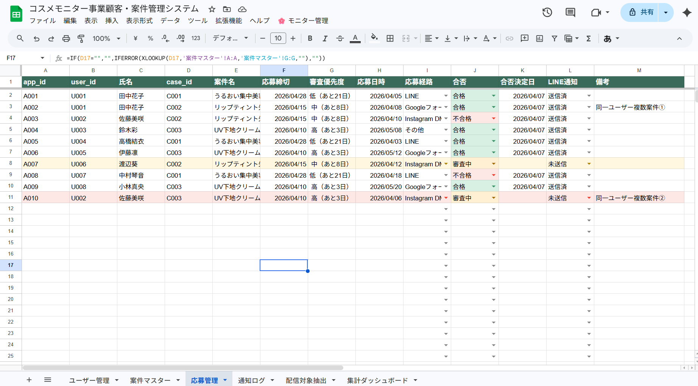
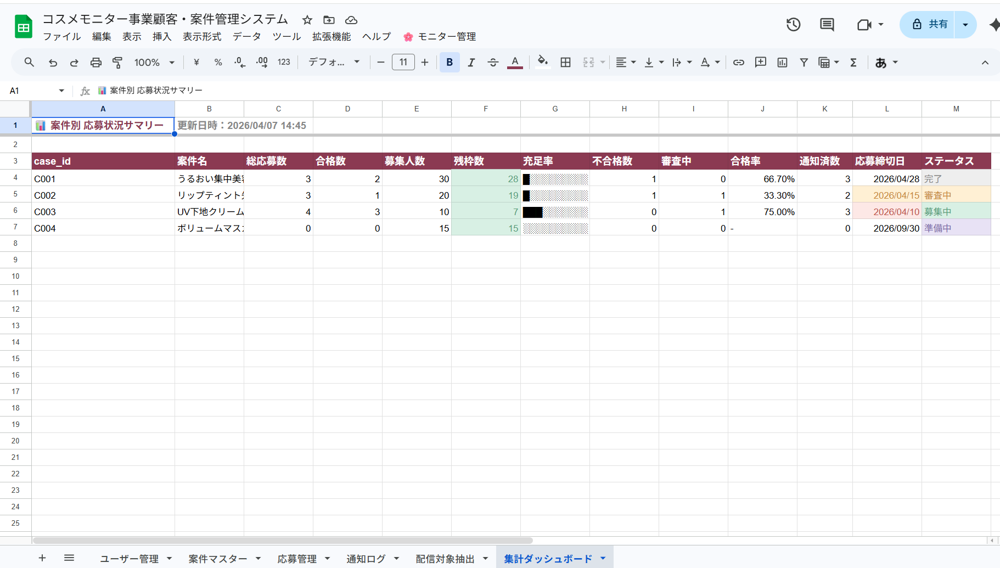
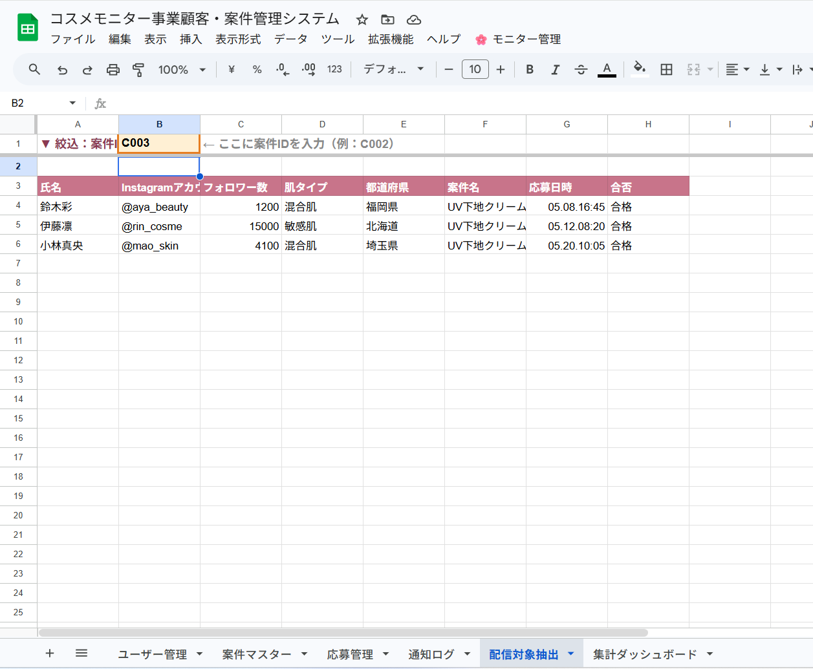
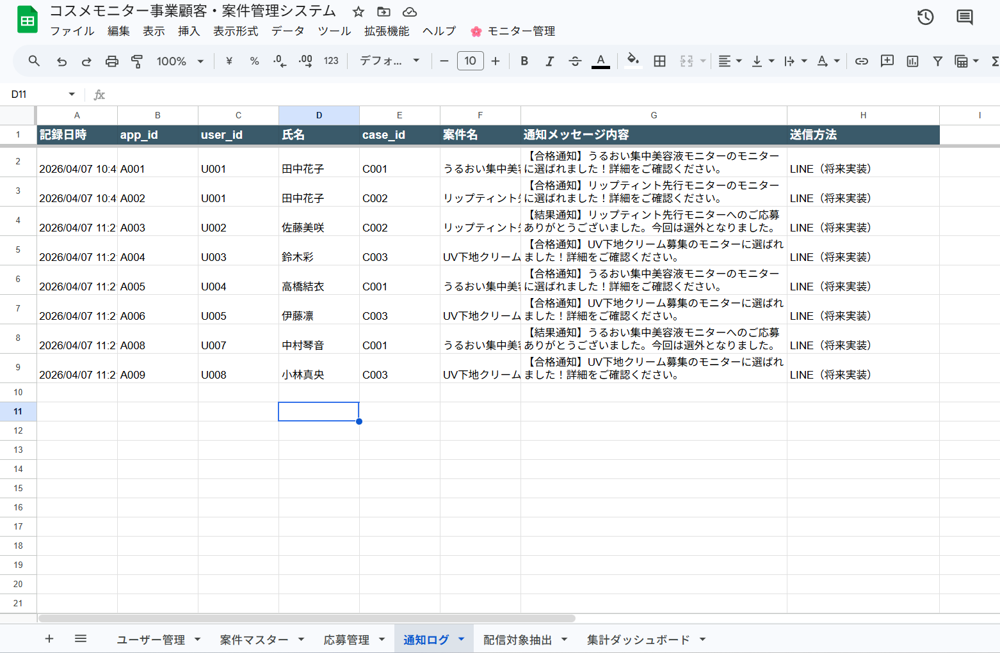
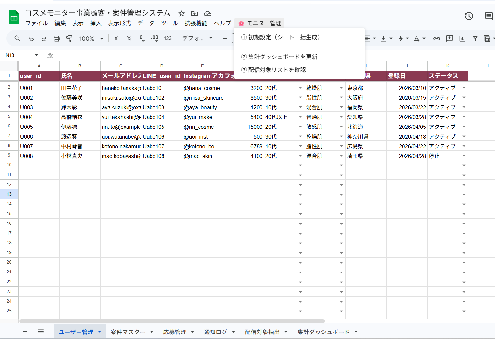

<h1>コスメモニター顧客・案件管理システム</h1>

<div align="center">

<p><strong>「募集から配信まで、スプレッドシート1本で一気通貫」</strong></p>

<p>


</p>

<p><strong>コスメモニター事業の応募管理・合否審査・配信リスト抽出を完全自動化</strong></p>

<p><strong>注意</strong>: このリポジトリはポートフォリオ用です。ソースコードは非公開です。</p>

</div>

---

## 📖 目次

- [システム概要](#システム概要)
- [開発背景](#開発背景)
- [主な機能](#主な機能)
- [画面イメージ](#画面イメージ)
- [システムの流れ](#システムの流れ)
- [技術的な工夫](#技術的な工夫)
- [技術スタック](#技術スタック)
- [システム構成](#システム構成)
- [学びと強み](#学びと強み)
- [今後の拡張](#今後の拡張)
- [提供可能なサービス](#提供可能なサービス)
- [開発者について](#開発者について)
- [お問い合わせ](#お問い合わせ)
- [ライセンス](#ライセンス)

---

## 🎯 システム概要

コスメモニター事業の「募集〜審査〜配信」を、Googleスプレッドシート＋GASで一元管理するシステムです。  
Instagram/LINEから流入するユーザーと複数の案件を、ミスなく効率的にマッチング・管理できます。

### 3つの特徴

| 特徴 | 内容 |
|------|------|
| **データベース設計** | ユーザー・案件・応募を正規化して管理。将来のLINE API連携を見据えた拡張可能な構造 |
| **リアルタイム自動化** | 合否変更と同時に通知ログ・決定日・配信ステータスが自動更新。手作業ゼロ |
| **直感的な優先管理** | 審査優先度・残枠・締切警告を色とバーで可視化。一目で状況把握 |

### 対象ユーザー

| 利用者 | 使い方 |
|--------|--------|
| 案件担当者 | 案件マスターに募集情報を登録・ステータス更新 |
| 審査担当者 | 応募管理シートで合否をプルダウン選択するだけ |
| 配信担当者 | 案件IDを入力するだけで合格者リストが自動表示 |

**プロジェクト規模**

| 項目 | 内容 |
|------|------|
| 開発期間 | 約2週間 |
| GASファイル数 | 5ファイル（01_setup / 02_notify / 03_summary / 04_delivery / 05_auto_id） |
| シート数 | 6シート（ユーザー管理・案件マスター・応募管理・配信対象抽出・集計ダッシュボード・通知ログ） |
| 管理可能行数 | 最大1,000行/シート |

---

## 💡 開発背景

### ❌ コスメモニター事業現場の課題

**課題1：管理が分散してミスが発生する**

> 募集・審査・配信がバラバラのシートやLINEグループで管理され、合否漏れや重複送付が発生しやすい。

**解決策：** 応募管理シートを「心臓部」とした4シート構造で、情報を1箇所に集約

---

**課題2：配信リストの手作業が毎回発生する**

> 「合格者だけ抽出してリストを作る」作業を毎回手動で行っており、担当者の負担になっている。

**解決策：** 案件IDを入力するだけでFILTER関数が合格者を自動抽出

---

**課題3：審査の優先順位が感覚頼み**

> 締切間近の案件・残枠が少ない応募者の審査を優先すべきかが、数字を見ないとわからない。

**解決策：** GASとLET関数で「高（あと3日）」のような審査優先度を自動表示・色分け

---

**課題4：将来のLINE連携を見据えた設計ができていない**

> とりあえず管理できるシートは作れても、LINEと繋いだ際にデータ構造が合わず作り直しになりやすい。

**解決策：** LINE_user_id列を設計に含め、API送信処理をコメントアウトで保持。受注後にすぐ実装できる下地を準備

---

## ✨ 主な機能

### 📋 ユーザー管理シート

- モニター会員の基本情報（氏名・メール・Instagram・フォロワー数・肌タイプ）を一元管理
- `user_id` はデータ入力と同時に `U001` 形式で自動採番
- プルダウン：年代・肌タイプ・ステータス（アクティブ/停止/ブロック）

> **工夫ポイント：** LINE_user_id列を必須列として設計。LINEからの応募者に最初から紐付けられる構造にしました

---

### 📦 案件マスターシート

- モニター案件の全情報（商品名・募集人数・応募期間・条件）を管理
- `case_id` も入力と同時に自動採番
- ステータス：準備中 / 募集中 / 審査中 / 配送済 / 完了 / 中止

---

### 🔑 応募管理シート（心臓部）

- 1行 = 1ユーザー × 1案件の応募として記録
- 氏名・案件名は `user_id` / `case_id` からXLOOKUPで自動参照
- 応募締切は案件マスターから自動連携
- **審査優先度**：締切日・残枠数から `高（あと3日）` `中（あと10日）` を自動計算
- 合否をプルダウンで変更 → 決定日・LINE通知欄・通知ログが自動更新

| 条件付き書式 | 表示 |
|------------|------|
| 合格 | セル：薄緑 |
| 不合格 | セル：薄赤 |
| 審査中 × 優先度「高」 | 行全体：薄赤 |
| 審査中 × 優先度「中」 | 行全体：薄黄 |

---

### 📊 集計ダッシュボード

- 全案件の応募数・合格数・残枠数・充足率・通知済数を一覧表示
- 充足率はテキストバー（`█████░░░░░ 50.0%`）で直感的に可視化
- 残枠・締切日・ステータスに色付け警告

| 条件 | 色 |
|------|-----|
| 残枠ゼロ | 赤（満枠） |
| 残枠50%未満 | 黄（あと少し） |
| 締切7日以内 | 赤 |
| 締切8〜14日 | 黄 |

---

### 📤 配信対象抽出シート

- B1セルに案件IDを入力するだけで合格者リストが自動表示
- 氏名・Instagram・フォロワー数・肌タイプ・都道府県を一覧出力
- メニューから合格者をモーダルダイアログで確認可能

---

## 📸 画面イメージ

### 応募管理シート（審査優先度・色付き）

<div align="center">
  
</div>

審査優先度が自動計算されて表示。審査中かつ優先度「高」の行が赤く色付けされ、緊急対応が必要な応募を即座に把握できます。

---

### 集計ダッシュボード（充足率バー・警告色）

<div align="center">
  
</div>

充足率がビジュアルバーで表示。締切が近い案件・残枠が少ない案件が色で一目でわかります。

---

### 配信対象抽出シート（FILTER関数）

<div align="center">
  
</div>

B1の案件IDを変更するだけでリストが即座に更新。合格者の属性情報も一覧で確認できます。

---

### 通知ログシート

<div align="center">
  
</div>

合否変更のたびに自動記録。いつ・誰に・どの案件の結果を通知したかが追跡可能です。

---

### カスタムメニュー

<div align="center">
  
</div>

スプレッドシートを開くと「🌸 モニター管理」メニューが自動追加されます。

---

## 🧩 システムの流れ

① ユーザー登録（ユーザー管理シートに入力 → user_id自動採番）  
↓  
② 案件登録（案件マスターに入力 → case_id自動採番）  
↓  
③ 応募記録（応募管理シートにuser_id・case_idを入力 → app_id自動採番）  
↓  ← 氏名・案件名・応募締切・審査優先度が自動表示  
④ 審査（合否列をプルダウンで選択）  
↓  ← 決定日・LINE通知欄・通知ログが自動更新  
⑤ 配信リスト確認（配信対象抽出シートのB1に案件ID入力）  
↓  ← 合格者一覧がFILTERで自動表示  
⑥ 集計確認（メニュー→集計ダッシュボードを更新）

**[将来実装] LINE Messaging API連携フロー**

Instagram広告 → LINE公式アカウント友だち追加  
↓  
Googleフォームから応募（LINE_user_id自動連携）  
↓  
合否確定 → LINE Messaging APIで自動通知

---

## 🔧 技術的な工夫

### 工夫1：審査優先度の複合判定ロジック（LET関数）

**課題：** 締切日だけでなく残枠数も考慮した優先度を、数式だけで実現する必要があった

**解決策：** GASでLET関数を動的に生成し、締切残日数・残枠数・合格済み数を複合判定

```javascript
// 締切7日以内 OR 残枠5件以下 → 「高」
// 締切14日以内 OR 残枠10件以下 → 「中」
// それ以外 → 「低」
// さらに残日数を「（あとN日）」として併記
```

**効果：** 「高（あと3日）」のような一目でわかる表示を数式のみで実現

---

### 工夫2：ID自動採番の安全設計（05_auto_id.gs）

**課題：** 複数人が同時編集した場合に採番が重複するリスクがある

**解決策：** `LockService.getDocumentLock()` でドキュメントロックを取得し、採番処理を排他制御

```javascript
var lock = LockService.getDocumentLock();
try {
  lock.waitLock(10000); // 10秒待機
  // 採番処理
} finally {
  lock.releaseLock(); // 必ずロック解除
}
```

**効果：** 複数担当者の同時入力でも採番が重複しない安全な設計

---

### 工夫3：LINE連携の「将来実装」設計

**課題：** 現時点でLINE APIの認証情報がない状態でも、受注後すぐ実装できる構造にしたい

**解決策：** LINE送信処理をコメントアウトで保持し、コードの構造・API仕様を明示

```javascript
// 【将来実装】LINE Messaging API 送信処理
// function sendLineMessage(lineUserId, message) {
//   const TOKEN = PropertiesService.getScriptProperties().getProperty('LINE_TOKEN');
//   UrlFetchApp.fetch('https://api.line.me/v2/bot/message/push', {...});
// }
```

**効果：** 受注後はLINE_TOKENを設定してコメントを外すだけで即実装可能

---

## 🛠 技術スタック

| 項目 | 技術 | 採用理由 |
|------|------|----------|
| 自動化・ロジック | Google Apps Script | GmailやDriveとの統合が容易。クライアントが追加コスト不要で利用可能 |
| データ管理 | Google スプレッドシート | ノーコードで操作可能。複数担当者がリアルタイム共同編集できる |
| データ抽出 | FILTER / XLOOKUP / QUERY | 関数のみで複雑な条件抽出を実現。VBA不要・メンテナンスしやすい |
| 複合ロジック | LET関数 | 変数を使いまわすことで長い数式を読みやすく整理 |
| 将来連携 | LINE Messaging API | 受注後の拡張を想定。コメントアウトで設計を保持 |

### なぜこの技術を選んだのか

既存のCRMシステムは導入コストが高く、新規事業のスタートアップ期には不向きです。  
スプレッドシート＋GASは「無料で使えて、すぐ修正できて、担当者が自分で操作できる」という  
小規模事業者に最適な構成です。また、将来的なLINE連携・Zapier連携への拡張も容易に対応できます。

---

## 📂 システム構成

<details>
<summary>GASファイル構成（クリックで展開）</summary>

```
GASプロジェクト/
├── 01_setup.gs       # メニュー・全シート生成・プルダウン・条件付き書式
├── 02_notify.gs      # 合否変更トリガー・通知ログ記録（onEdit）
├── 03_summary.gs     # 集計ダッシュボード生成・更新
├── 04_delivery.gs    # 配信対象リストのモーダル表示
└── 05_auto_id.gs     # ID自動採番（排他制御付き）
```

</details>

<details>
<summary>シート構成（クリックで展開）</summary>

```
スプレッドシート/
├── ユーザー管理       # モニター会員マスタ（user_id, 氏名, LINE_user_id...）
├── 案件マスター       # モニター案件マスタ（case_id, 商品名, 募集人数...）
├── 応募管理          # 全応募の心臓部（app_id, user_id, case_id, 合否...）
├── 配信対象抽出       # FILTERで合格者を自動表示
├── 集計ダッシュボード  # 案件別サマリー（メニューで随時更新）
└── 通知ログ          # 合否確定時に自動追記
```

</details>

---

## 🎓 学びと強み

### このプロジェクトで学んだこと

#### 技術面

- GASの `onEdit` シンプルトリガーによるリアルタイム自動処理の実装
- `LockService` を使った排他制御によるデータ競合防止
- XLOOKUP・FILTER・LET関数の組み合わせによる複雑な条件抽出
- `HtmlService` を使ったモーダルダイアログ（HTML）の生成
- コメントアウトによる「将来実装コードの設計的な保持」

#### 要件定義・設計面

- 「ユーザー × 案件」の多対多の関係を中間テーブル（応募管理）で管理するデータ正規化の理解
- コスメモニター事業のInstagram→LINE→フォーム応募という実際の導線を分析し、設計に反映
- 複数担当者の役割（案件担当・審査担当・配信担当）を想定したUI/UX設計

### 得たスキル

- [x] GASによる複数シートの連動自動化
- [x] スプレッドシートのデータベース的な正規化設計
- [x] LET / XLOOKUP / FILTER 関数による複合条件処理
- [x] 条件付き書式による視覚的なステータス管理
- [x] 外部API連携（LINE）を見据えた拡張可能な設計

---

## 🚀 今後の拡張

- [ ] LINE Messaging APIとの連携（合否確定時に自動通知）
- [ ] Googleフォームと応募管理シートの自動連携（フォーム→シートへの自動記録）
- [ ] Zapier / Makeを使ったInstagram DMからの応募自動取り込み
- [ ] 一次選考の自動化（フォロワー数・肌タイプでの自動フィルタリング）
- [ ] 案件別の応募分析レポート（グラフ・CSV出力）

---

## 💼 提供可能なサービス

1. **スプレッドシート設計・構築**
   - 業務フローに合わせたシート設計・関数設計
   - データ正規化・入力規則・条件付き書式の整備
   > 「今使っているシートが管理しにくい」という方の改善・最適化も対応可能です

2. **GAS自動化**
   - 合否変更トリガー・通知ログ・ID自動採番などの自動化処理
   - メニューボタンによる管理者操作のシンプル化

3. **外部連携の実装**
   - LINE Messaging API / Googleフォーム との連携
   - 受注後のヒアリングを経て、実運用フローに合わせて実装

※ 現在はポートフォリオ用途として段階的に開発・検証を行っており、提供形態や範囲については個別検討ベースとなります。

---

## 👤 開発者について

**制作者**: Misako  
**前職**: 金融機関（顧客管理システムの日常利用経験あり）  
**現在**: 個人事業主 × AIエンジニア学習・実務中

**開発スタンス**

- 「コードが書ける」より「課題が解決できる」を重視
- 実務フローを徹底分析してから設計する
- AIツール（Claude, Cursor等）を活用した効率的な開発

**こんな方のご相談に向いています**

- 「スプレッドシートの管理が手作業で限界になってきた」
- 「LINEやInstagramと繋いで自動化したい」
- 「どこから手をつければいいかわからない」

---

## 📩 お問い合わせ

### ポートフォリオ全体に関するご相談・ご質問

#### 📩 公式LINE（推奨）

[👉 公式LINEで問い合わせる](https://lin.ee/LQKST5q)

- **気軽にご相談いただけます**（24時間受付）
- レスポンス：原則24時間以内

#### 💼 クラウドソーシングサイト

- [ランサーズ](https://www.lancers.jp/profile/Mi1103)
- [クラウドワークス](https://crowdworks.jp/public/employees/6463085)
- [ココナラ](https://coconala.com/users/5336527)

「こんなこと相談していいのかな？」という段階からでも大歓迎です。

---

## 📄 ライセンス

このシステムのソースコードは非公開です。  
ポートフォリオ用のREADME・画像は閲覧のみ可能です。

導入・カスタマイズをご希望の場合は、お問い合わせください。

---

<div align="center">

<p><strong>「募集から配信まで、スプレッドシート1本で一気通貫」</strong></p>

<hr>

<p>
<strong>制作者</strong>: Misako<br>
<strong>制作時期</strong>: 2026年4月<br>
<strong>技術スタック</strong>: Google Apps Script / Google スプレッドシート / FILTER・XLOOKUP・LET関数 / LINE API（設計済）
</p>

<hr>

<p>
⭐ このプロジェクトが参考になりましたら、Starをいただけると嬉しいです<br>
📢 シェア・拡散も大歓迎です
</p>

<hr>

<p><em>最終更新日: 2026年4月</em></p>

</div>
