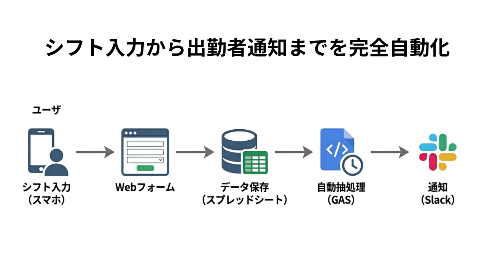
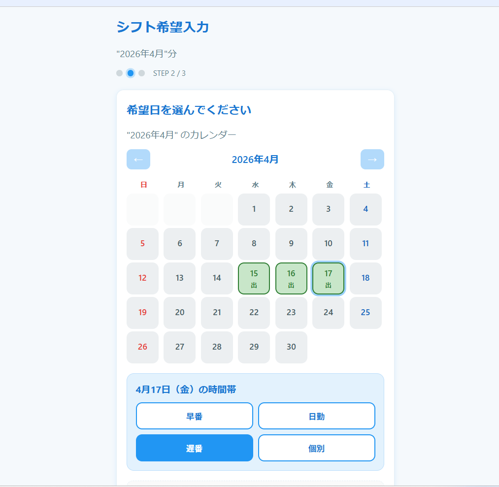
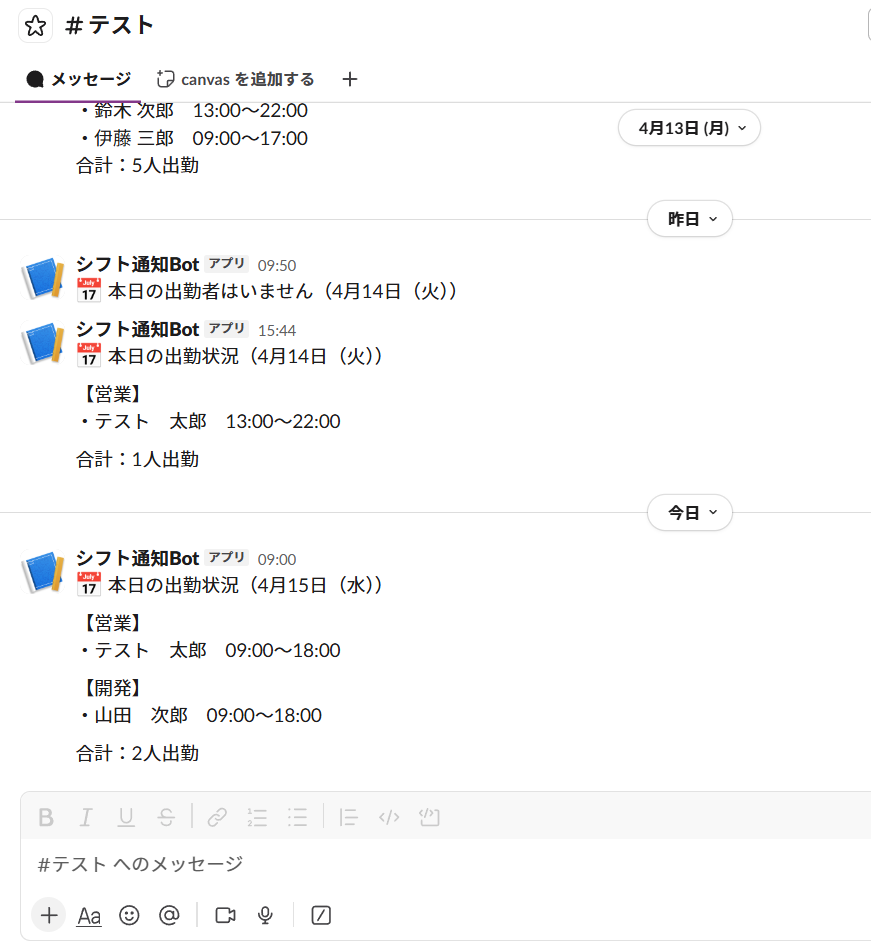

<h1>出勤者自動通知システム（Slack連携）</h1>

スタッフがWebから入力したシフトをGoogleスプレッドシートで一元管理し、毎朝の出勤メンバーをSlackへ自動通知する業務効率化システムです。

<h2>課題解決ポイント</h2>
<ul>
<li><strong>手動メンションの廃止：</strong> 毎朝の「今日の出勤者は誰？」という確認作業がなくなります。</li>
<li><strong>入力ミスの防止：</strong> スプレッドシートを直接編集せず、専用Webフォームからスマホで入力可能です。</li>
<li><strong>低コスト・高機能：</strong> サーバー費用不要。GAS（Google Apps Script）のみで完結するため、月額無料。</li>
</ul>

<h2>使用技術</h2>
<ul>
<li>Google Apps Script (GAS)</li>
<li>Google Sheets API</li>
<li>Slack API (Webhooks)</li>
<li>HTML5 / CSS3</li>
</ul>

<h2>実装内容</h2>
<ul>
<li>日付照合ロジック：当日の日付とシートのA列を自動照合。</li>
<li>Slack Webhook通知：動的なテキスト生成による自動投稿。</li>
<li>Web App化：index.htmlを使用したスタッフ向けユーザーインターフェース。</li>
<li>エラーハンドリング：APIエラー時のログ記録と管理者通知。</li>
</ul>

<h2>システム構成 / フロー</h2>

1. スタッフがスマホ（Web）からシフト入力 
2. スプレッドシートへリアルタイム反映 
3. 指定時間にGASが当日分を抽出 
4. Slackチャネルへ自動メンション投稿

<h2>スクリーンショット</h2>

※実際の動作画面イメージ

<h2>対応範囲</h2>
<ul>
<li>既存スプレッドシートの構造解析と連携</li>
<li>Slackアプリ（Webhook）の設定サポート</li>
<li>Webフォームの項目カスタマイズ</li>
</ul>

<h2>未対応範囲</h2>
<ul>
<li>Slackからスプレッドシートへの「逆方向」の書き込み操作（※追加開発可）</li>
<li>複雑な勤怠計算（深夜残業・休憩時間の自動計算）</li>
</ul>

<h2>改善予定</h2>
<ul>
<li>複数チャンネルへの同時通知対応</li>
<li>Googleカレンダーへの自動反映機能の追加</li>
<li>例外処理（エラーログ）の管理画面UI化</li>
</ul>
