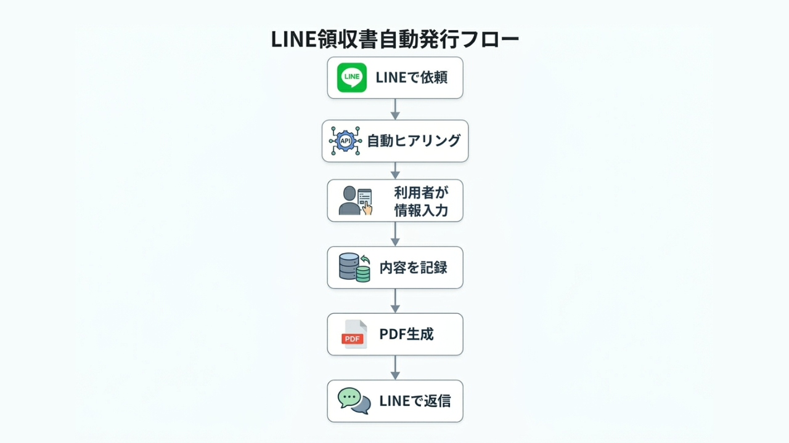
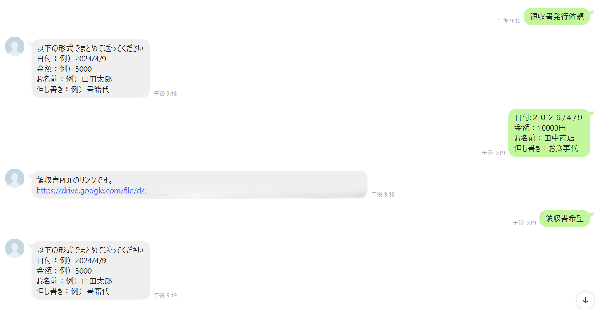
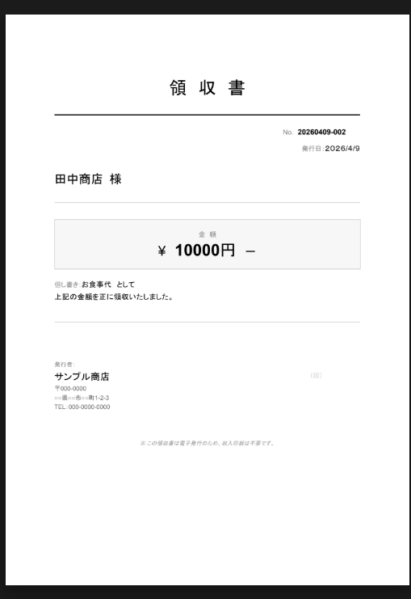

<h1>LINE領収書自動発行・返信システム</h1>

LINEから届く「領収書がほしい」という要望に対し、AI的な自動ヒアリングとPDF生成を行い、その場で返信する事務自動化ソリューションです。

<h2>課題解決ポイント</h2>
<ul>
<li><strong>現場の事務負担をゼロに</strong>：顧客とのLINEのやり取りの中で領収書が完成するため、後でPCを開いて作成する手間がなくなります。</li>
<li><strong>精度の高い自動入力</strong>：全角・半角の混在や不要なスペースを自動で補正する機能を搭載。入力ミスによる再発行リスクを最小化します。</li>
<li><strong>管理の自動化</strong>：発行したPDFはGoogleドライブへ、発行履歴はスプレッドシートへ自動保存されるため、確定申告時の管理も容易です。</li>
</ul>

<h2>使用技術</h2>
<ul>
<li>Google Apps Script (GAS)</li>
<li>LINE Messaging API</li>
<li>Google Drive / Spreadsheet API</li>
</ul>

<h2>実装内容</h2>

本システムは、LINE公式アカウントを通じて顧客と対話を行い、領収書を即時発行します。

<ul>
<li>特定のキーワード（例：領収書）によるトリガー起動</li>
<li>対話型インターフェースによる必要項目（宛名・金額・但書）の収集</li>
<li>テンプレートを元にしたPDFデザインの自動生成</li>
<li>LINE内でのPDFプレビュー・ダウンロード提供</li>
</ul>

<h2>システム構成 / フロー</h2>

1. ユーザー：LINEで「領収書希望」と送信 
2. GAS：ヒアリングメッセージを自動返信 
3. ユーザー：必要情報を回答 
4. GAS：情報を正規化（補正）し、スプレッドシートへ記録。PDFを生成してLINEへ返信

<h2>スクリーンショット</h2>

※実際の動作画面イメージ

<h2>対応範囲</h2>
<ul>
<li>LINE Messaging APIとの連携設定</li>
<li>GASによるPDF生成ロジックの開発</li>
<li>スプレッドシートへのログ記録機能</li>
<li>お名前・金額の表記ゆれ補正フィルタ</li>
</ul>

<h2>未対応範囲</h2>
<ul>
<li>複雑な分岐条件（例：複数宛名・分割発行など）への対応</li>
<li>デザインの細かいカスタマイズ（企業ロゴ・レイアウトの完全再現など）</li>
<li>大量同時リクエスト時の負荷分散設計（現状は小規模利用想定）</li>  
</ul>

<h2>改善予定</h2>
<ul>
<li><strong>例外処理の強化</strong>：予期せぬ文字列が入力された際のガイドメッセージ機能。</li>
<li><strong>管理パネルの作成</strong>：スプレッドシート上からワンクリックで再送できる機能。</li>
<li><strong>認証機能</strong>：特定ユーザーのみが発行依頼を行えるセキュリティ制限。</li>
</ul>
