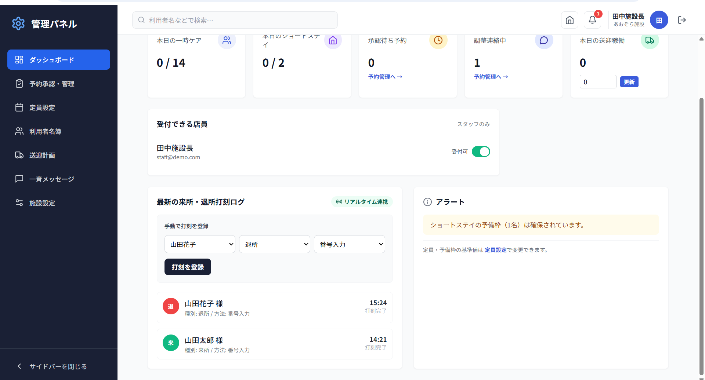
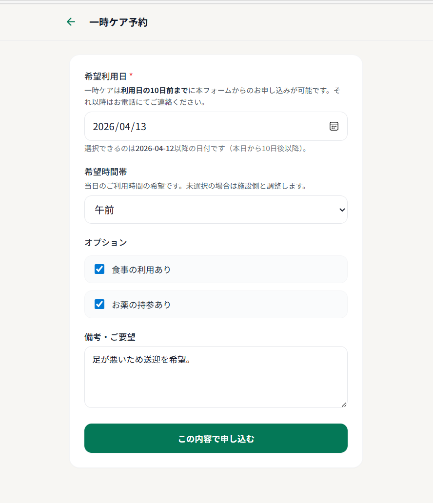
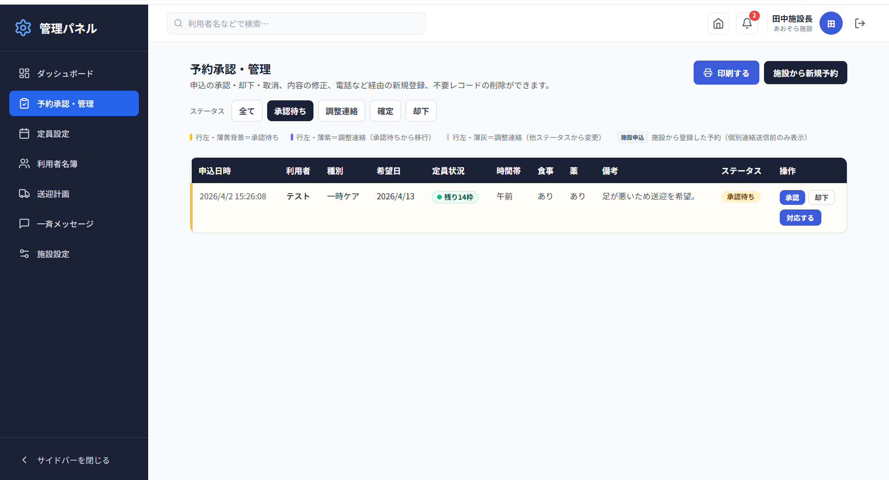
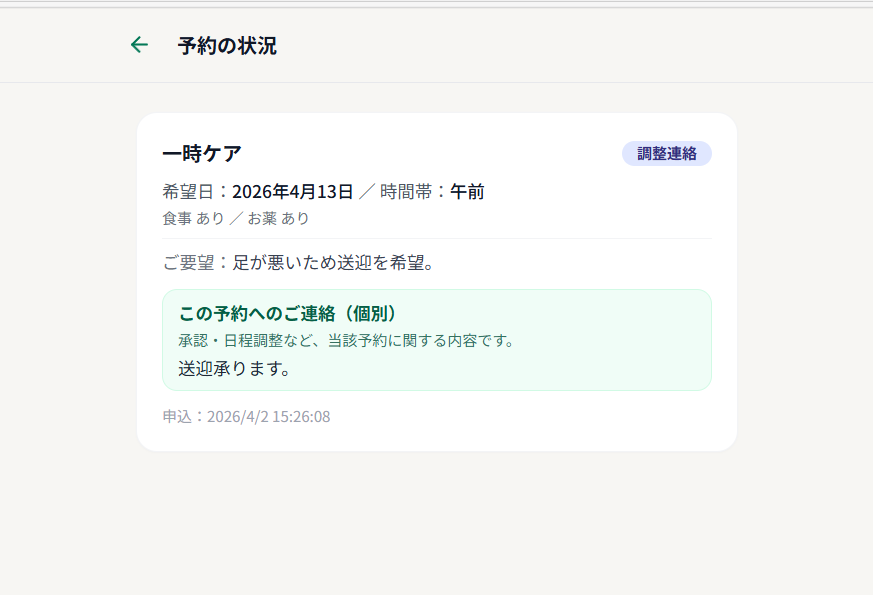
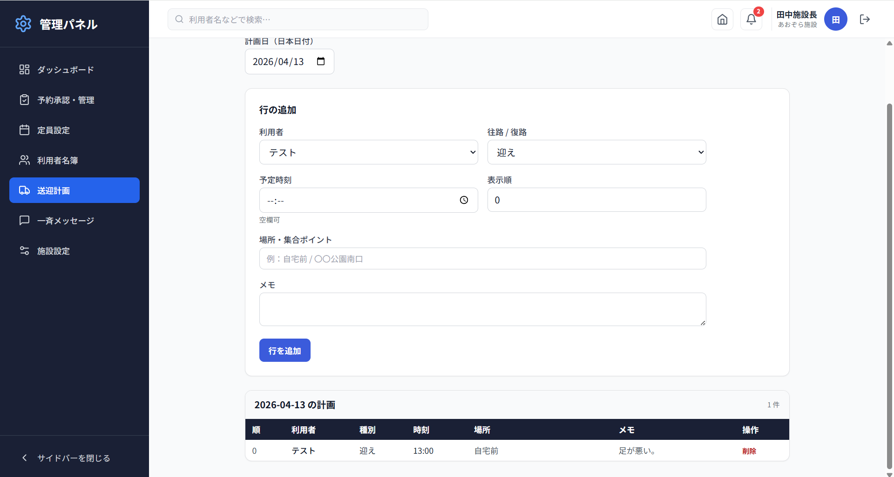

<!-- ========================================= -->
<!-- 📌 ヘッダー（HTML固定） -->
<!-- ========================================= -->

<h1>福祉施設向け予約・管理システム</h1>

<div align="center">

<p><strong>電話・紙の予約管理を、Webで完全デジタル化。現場が本当に使えるシステムを設計しました。</strong></p>

<p>


</p>

<p><strong>デイサービス・ショートステイ施設の予約申込〜承認〜来所打刻〜送迎計画をワンストップで管理</strong></p>

<p><strong>注意</strong>: このリポジトリはポートフォリオ用です。ソースコードは非公開です。</p>

</div>

---

<!-- ========================================= -->
<!-- 📌 本文（Markdown） -->
<!-- ========================================= -->

## 📖 目次

- [🎯 システム概要](#-システム概要)
- [💡 開発背景](#-開発背景)
- [✨ 主な機能](#-主な機能)
- [📊 Before / After](#-before--after)
- [📸 画面イメージ](#-画面イメージ)
- [🧩 システムの流れ](#-システムの流れ)
- [🔧 技術的な工夫](#-技術的な工夫)
- [🛠 技術スタック](#-技術スタック)
- [🎓 学びと強み](#-学びと強み)
- [🚀 今後の拡張](#-今後の拡張)
- [💼 提供可能なサービス](#-提供可能なサービス)
- [👤 開発者について](#-開発者について)
- [📩 お問い合わせ](#-お問い合わせ)
- [📄 ライセンス](#-ライセンス)

---

## 🎯 システム概要

福祉施設（デイサービス・ショートステイ）の**予約申込から承認・定員管理・来所打刻・送迎計画**までを一元化したWebシステムです。

スタッフと利用者でロール別の専用画面を用意し、これまで電話・紙・口頭で行っていた業務をデジタル化しました。

### 3つの特徴

| 特徴 | 内容 |
|------|------|
| **定員超過ゼロ** | PostgreSQLトリガーがDBレベルで超過を物理的に防止 |
| **ロール別完全分離** | RLS（行レベルセキュリティ）でスタッフ・利用者のデータを厳格に分離 |
| **印刷対応** | 予約一覧・個別連絡履歴をそのままA4印刷。紙運用とも共存可能 |

### 対象ユーザー

| ユーザー | 利用シーン |
|----------|-----------|
| 施設スタッフ（管理者） | 予約承認・定員管理・来所確認・送迎計画・一斉連絡 |
| 施設利用者・家族 | 予約申込・予約状況確認・スタッフからのメッセージ受信 |

### プロジェクト規模

| 項目 | 内容 |
|------|------|
| 開発期間 | 約2週間 |
| 画面数 | 管理8画面 ＋ 利用者3画面 ＋ 共通2画面 |
| DBテーブル | 10テーブル・トリガー2本・RLSポリシー多数 |
| Edge Functions | 3本（利用者登録・削除・パスワード再設定） |

---

## 💡 開発背景

福祉施設では、下記のような現場課題が広く見られます。

### ❌ 課題と ✅ 解決策

**❌ 課題1：予約の二重登録・定員超過**
- 電話・窓口・家族からの申込が混在し、手動で台帳管理しているため確認ミスが発生する

✅ **解決策：** PostgreSQLの`BEFORE INSERT/UPDATE`トリガーで定員を物理チェック。フロント側の事前確認と二重防止の層構造で確実に防ぎます

---

**❌ 課題2：スタッフ間の情報共有の遅れ**
- ケア内容（食事・薬）や個別連絡が紙・口頭で共有されており、当日になるまで全員が把握できない

✅ **解決策：** 予約ごとの食事・薬オプション、個別連絡履歴をWebで一元管理。スタッフ全員がリアルタイムに参照できます

---

**❌ 課題3：来所確認が台帳頼み**
- 当日の来所・退所を紙台帳に記録しているため、集計や確認に時間がかかる

✅ **解決策：** スタッフが来所・退所を打刻するとSupabase Realtimeで即座にダッシュボードに反映。別端末からでも同時確認できます

---

**❌ 課題4：送迎ルートが属人的**
- 送迎担当者が毎日メモや口頭で確認しており、記録として残りにくい

✅ **解決策：** 日付・利用者・迎え/送り・時刻・場所をスタッフが登録する送迎計画機能を実装。過去の記録も参照可能です

---

## ✨ 主な機能

### 🏠 利用者向け

**📝 予約申込フォーム**
- 一時ケア・ショートステイの希望日・時間帯・食事・薬をWebから申込
- 申込後はステータス（承認待ち・調整連絡・確定・却下）を一覧で確認

**💬 個別連絡・お知らせ受信**
- スタッフからの個別メッセージ（日程調整・ケア確認等）を受信
- 施設からの一斉メッセージ（休館・お知らせ等）を確認

---

### 🏢 スタッフ（管理者）向け

**📊 管理ダッシュボード**
- 本日の定員状況・承認待ち件数・調整連絡件数・送迎稼働数をKPIカードで表示
- 定員アラート・来所打刻ログをリアルタイムに表示

> **工夫ポイント：** 定員アラートの閾値表示により、残枠が少ない日を一目で把握できます

**✅ 予約承認・管理**
- 一覧からステータス絞り込み（承認待ち・調整連絡・確定等）
- ワンクリック即時承認/却下、モーダルで個別連絡送信と同時にステータス変更
- 予約一覧をA4サイズで印刷出力

**🔢 定員管理**
- 一時ケア・ショートステイごとの定員・予備枠（施設直接申込用）をGUI設定
- 一般利用者と施設スタッフで異なる上限ロジックをDB側で制御

**⏰ 来所・退所打刻**
- スタッフが利用者の来所・退所をWebから登録
- Supabase Realtimeで打刻ログをリアルタイム反映

**🚗 送迎計画**
- 日付ごとに迎え・送りの予定（利用者・時刻・場所・メモ）を登録・管理
- 印刷対応

**👥 利用者名簿**
- 利用者の登録・編集・削除（Edge Function経由）
- 管理画面からの仮パスワード再設定
- 個別連絡履歴の印刷出力

**📣 一斉メッセージ配信**
- アプリ内チャンネルで全利用者向けのお知らせを配信

---

## 📊 Before / After

### Before（導入前）
```
📞 電話で予約を受ける
↓
📝 紙の台帳に手書き登録
↓
❓ 定員を超えていないか手動で確認
↓
📋 当日スタッフが紙を見て確認
↓
🗣 送迎担当者へ口頭・メモで連絡
```

**問題点：** 情報がバラバラで共有が遅れる。定員ミスが起きやすい。来所確認・送迎調整に時間がかかる。

---

### After（本システム導入後）
```
💻 利用者がWebで予約申込
↓
🔔 スタッフがダッシュボードで即時確認
↓
✅ ワンクリック承認（定員超過はDBが自動防止）
↓
📱 承認結果・個別連絡が利用者に即時反映
↓
📊 来所打刻でリアルタイム出欠管理
↓
🗓 送迎計画を日付別に一元管理
```

**改善効果：**
- 予約受付の電話対応を大幅削減
- 定員超過ゼロ（DBトリガーで物理的に防止）
- スタッフ間のリアルタイム情報共有が実現
- 印刷対応で紙の業務フローとも共存可能

---

## 📸 画面イメージ

<div align="center">
  
  <p><em>管理ダッシュボード：本日の定員状況・承認待ち件数・打刻ログ・定員アラートを一覧表示</em></p>
</div>

<div align="center">
  
  <p><em>予約申込フォーム：利用者が種別・日時・食事・薬をWebから申込</em></p>
</div>

<div align="center">
  
  <p><em>予約管理画面：ステータス絞り込み・即時承認/却下・個別連絡送信</em></p>
</div>

<div align="center">
  
  <p><em>利用者マイページ：予約状況・スタッフからの個別連絡をリアルタイム確認</em></p>
</div>

<div align="center">
  
  <p><em>送迎計画・来所打刻：日付別の送迎ルート管理と出欠ログをスタッフが一元管理</em></p>
</div>

---

## 🧩 システムの流れ
```
【利用者】
  Web予約申込
    ↓
【DB】
  定員トリガーで自動チェック（超過 → エラー返却）
    ↓
【スタッフ】
  ダッシュボードで確認
    ↓
  ① 即時承認 → [approved]
  ② 個別連絡送信 → [adjusting_contact] → モーダルで承認 → [approved]
  ③ 却下 → [rejected]
    ↓
【利用者】
  マイページでステータス・連絡を確認
    ↓
【当日】
  スタッフが来所打刻 → Realtimeでダッシュボードに反映
    ↓
  送迎計画で迎え・送りを管理
```

---

## 🔧 技術的な工夫

### 工夫1：定員管理の二重防止

**課題：** フロント側のチェックだけでは、同時申込時に定員超過が起きるリスクがある

**解決策：** 二層構造で防止
- Layer 1（フロント）：DBから承認済み件数を取得して事前にエラー表示
- Layer 2（DB）：PostgreSQL `BEFORE INSERT/UPDATE` トリガーで物理的にブロック。`P0001` エラーとして返却し、フロントで`isCapacityExceededError()`を使って日本語メッセージに変換

**さらに：** 一般利用者（Web申込）と施設スタッフ（直接申込）で異なる上限ロジックを同一トリガー内で分岐
```
一般利用者: approved + pending + adjusting_contact の合計 ≥ daily_capacity でエラー
施設スタッフ: approvedのみ ≥ daily_capacity + reserve_slots でエラー
```

---

### 工夫2：多段階ステータス管理

**課題：** 予約の「承認待ち」「調整中」「確定」などの状態を管理しやすくする必要がある

**解決策：** ステータスを5段階に細分化し、`adjusting_from_pending`フラグで自動遷移か手動変更かを区別。一覧の色分け・フィルタリングで業務優先度が一目でわかる設計
```
pending（承認待ち）
  └→ adjusting_contact（調整連絡）※スタッフが個別連絡送信時に自動遷移
       └→ approved（承認済み）
pending → approved（即時承認）
approved → cancelled（取消）
pending/adjusting → rejected（却下）
```

---

### 工夫3：印刷対応のUI設計

**課題：** モーダル内コンテンツを通常の `@media print` では印刷できない

**解決策：** 動的DOM生成パターンを採用。印刷専用コンテナを `<body>` に追加し `window.print()` 後に `afterprint` イベントでクリーンアップ。`@page` で A4縦・余白を設定

---

### 工夫4：RLSによるロール分離

**課題：** スタッフと利用者のデータ範囲をセキュアに分ける必要がある

**解決策：** Supabase RLS（Row Level Security）でDBレベルのポリシーを設定。フロント側の画面分岐だけでなく、DB側で二重に担保することで不正なデータアクセスを防止

---

## 🛠 技術スタック

| カテゴリ | 技術 | 採用理由 |
|----------|------|----------|
| フロントエンド | React 18 + TypeScript 5 | 型安全性・コンポーネント再利用・保守性 |
| スタイリング | Tailwind CSS 3 / Lucide React | 素早いUI構築・一貫したデザインシステム |
| バックエンド | Supabase（PostgreSQL） | Auth・RLS・Realtime・Edge Functionsをオールインワンで提供 |
| リアルタイム | Supabase Realtime（postgres_changes） | 来所打刻ログの即時反映に最適 |
| サーバーサイド処理 | Supabase Edge Functions（Deno） | スタッフセッションを切らずに利用者アカウントを操作するために必須 |
| セキュリティ | RLS + ロール分離（staff/user） | DBレベルでスタッフ・利用者のデータを完全分離 |
| ルーティング | React Router DOM v7 | SPAの画面遷移・ロール別ルートガード |
| ビルドツール | Vite 5 | 高速な開発サーバーとビルド |

---

## 🎓 学びと強み

### このプロジェクトで学んだこと

#### 技術面

- **PostgreSQLトリガー**によるDBレベルの整合性保証（フロント依存しない設計）
- **Supabase RLS**のポリシー設計（ロール別データ分離の実装）
- **React Context**を使った認証状態・施設設定のグローバル管理
- **Supabase Edge Functions**（Deno）でスタッフセッションを維持したままユーザー操作を実現
- **Supabase Realtime**（postgres_changes）の購読・クリーンアップパターン
- **動的DOM生成**による印刷機能の実装（モーダル内コンテンツの印刷問題を解決）
- **TypeScriptの正規化関数**でDBスキーマ変更に対して耐性のある型設計

#### 要件定義・設計面

- 福祉施設の現場フロー（予約受付〜承認〜当日対応）を想定した画面設計
- スタッフと利用者で全く異なるニーズを1つのシステムで満たす役割分担の設計
- 「完璧なデジタル化」ではなく「印刷対応で紙と共存できる」実用重視の判断
- データベース設計時の非正規化（`user_name`の冗長保持）でユーザー削除後も記録を維持

### 得たスキル

- [x] React + TypeScript によるSPA開発
- [x] Supabase（Auth / RLS / Realtime / Edge Functions）の実装
- [x] PostgreSQL トリガー・RLSポリシーの設計・実装
- [x] 多段階ステータス管理の設計パターン
- [x] 印刷対応UI（CSS @media print / 動的DOM生成）
- [x] ロール別ルートガード（ProtectedRoute）の実装
- [x] 実務フローを想定した要件定義・画面設計

---

## 🚀 今後の拡張

- [ ] LINE通知チャンネルの実装（broadcast_messages.channel='line'）
- [ ] 利用者名簿の検索機能
- [ ] 予約データのRealtime購読（現状は手動リフレッシュ）
- [ ] 承認時の送迎計画自動連携
- [ ] 管理画面のモバイル対応
- [ ] `staff_note`カラムの役割分離（申込種別フラグと連絡内容を分ける）
- [ ] `reservation_messages`の上限をDB制約で保証（現状はフロントロジック）

---

## 💼 提供可能なサービス

1. **同種システムの開発・カスタマイズ**
   - 福祉・医療・介護系施設向けの予約・来所管理システム
   - 定員管理ロジックや承認フローのカスタマイズ対応

2. **部分的な機能実装**
   - Supabase RLS・Realtime・Edge Functionsの導入支援
   - 既存システムへの印刷機能・PDF出力の追加

3. **業務フロー分析・要件整理**
   - 「何をシステム化すべきか」の整理から対応可能

> 現在はポートフォリオ用途として段階的に開発・検証を行っており、提供形態や範囲については個別検討ベースとなります。

---

## 👤 開発者について

**制作者：** Misako

前職は金融機関で顧客管理システムを日々活用。「なぜこんなに手作業が多いのか」という現場の違和感が、業務効率化への関心の出発点です。現在は個人事業主として活動しながら、GAS・React・Supabaseを中心にAIツールを活用した開発を実践中。

**得意・関心分野：**
- 小規模事業者・福祉施設などの業務DX
- 「使われる」ことを最優先にした実用的なシステム設計
- 現場フローを徹底分析した要件定義

**こんな方のご相談に向いています：**
- 電話・紙・Excelで管理している業務をデジタル化したい
- 予約・申込管理の仕組みをWebで作りたい
- 「何から始めればいいか」の段階からご相談したい

---

## 📩 お問い合わせ

### 📩 公式LINE（推奨）

[👉 公式LINEで問い合わせる](https://lin.ee/LQKST5q)

- 気軽にご相談いただけます（24時間受付）
- レスポンス：原則24時間以内

### 💼 クラウドソーシングサイト

- [ランサーズ](https://www.lancers.jp/profile/Mi1103)
- [クラウドワークス](https://crowdworks.jp/public/employees/6463085)
- [ココナラ](https://coconala.com/users/5336527)

「こんなこと相談していいのかな？」という段階からでも大歓迎です。

---

## 📄 ライセンス

このシステムのソースコードは非公開です。
ポートフォリオ用のREADME・画像は閲覧のみ可能です。

導入・カスタマイズをご希望の場合は、お問い合わせください。

---

<!-- ========================================= -->
<!-- 📌 フッター（HTML固定） -->
<!-- ========================================= -->

<div align="center">

<p><strong>電話・紙の予約管理を、Webで完全デジタル化。現場が本当に使えるシステムを目指しました。</strong></p>

<hr>

<p>
<strong>制作者</strong>: Misako<br>
<strong>制作時期</strong>: 2026年4月<br>
<strong>技術スタック</strong>: React 18 / TypeScript / Supabase / PostgreSQL / Tailwind CSS / Vite
</p>

<hr>

<p>
⭐ このプロジェクトが参考になりましたら、Starをいただけると嬉しいです<br>
📢 シェア・拡散も大歓迎です
</p>

<hr>

<p><em>最終更新日: 2026年4月</em></p>

</div>
